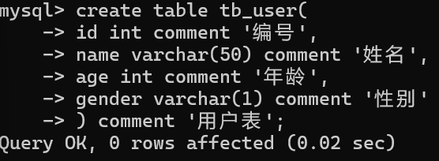

## SQL通用语法
- SQL语句可以单行或多行书写，以分号结尾
- SQL语句可以使用空格/缩进来增强语句的可读性
- MySQL数据库的SQL语句不区分大小写，关键字建议大写
- 注释：
    - 单行注释：`--注释内容`或`# 注释内容`
    - 多行注释：`/*注释内容*/`

### 数据类型

#### 数值类型

| 类型          | 大小                              | 用途      |
| ----------- | ------------------------------- | ------- |
| TINYINT     | 1 Bytes                         | 小整数值    |
| SMALLINT    | 2 Bytes                         | 大整数值    |
| MEDIUMINT   | 3 Bytes                         | 大整数值    |
| INT或INTEGER | 4 Bytes                         | 大整数值    |
| BIGINT      | 8 Bytes                         | 极大整数值   |
| FLOAT       | 4 Bytes                         | 单精度浮点数值 |
| DOUBLE      | 8 Bytes                         | 双精度浮点数值 |
| DECIMAL     | 对DECIMAL(M, D)，如果M>D，为M+2否则为D+2 | 小数值     |

#### 日期和时间类型

| 类型        | 大小（Bytes） | 用途           |
| --------- | --------- | ------------ |
| DATE      | 3         | 日期值          |
| TIME      | 3         | 时间值或持续时间     |
| YEAR      | 1         | 年份值          |
| DATETIME  | 8         | 混合日期和时间值     |
| TIMESTAMP | 4         | 混合日期和时间值，时间戳 |

#### 字符串类型

| 类型         | 大小                 | 用途               |
| ---------- | ------------------ | ---------------- |
| CHAR       | 0~255 Bytes        | 定长字符串            |
| VARCHAR    | 0~65535 Bytes      | 变长字符串            |
| TINYBLOB   | 0~255 Bytes        | 不超过255个字符的二进制字符串 |
| TINYTEXT   | 0~255 Bytes        | 短文本字符串           |
| BLOB       | 0~65535 Bytes      | 二进制形式的长文本数据      |
| TEXT       | 0~65535 Bytes      | 长文本数据            |
| MEDIUMBLOB | 0~16777215 Bytes   | 二进制形式的中等长度文本数据   |
| MEDIUMTEXT | 0~16777215 Bytes   | 中等长度文本数据         |
| LONGBLOB   | 0~4294967295 Bytes | 二进制形式的极大文本数据     |
| LONGTEXT   | 0~4294967295 Bytes | 极大文本数据           |

#### 枚举和集合类型
- ENUM：枚举类型，用于存储单一值，可以选择一个预定义的集合
- SET：集合类型，用于存储多个值，可以选择多个预定义的集合

#### 空间数据类型
GEOMETRY, POINT, LINESTRING, POLYGON, MULTIPOINT, MULTILINESTRING, MULTIPOLYGON, GEOMETRYCOLLECTION: 用于存储空间数据（地理信息、几何图形等）。

### SQL分类
- DDL：数据定义语言，用来定义语言，用来定义数据库对象（数据库，表，字段）
- DML：数据操作语言，用来对数据库表中的数据进行增删改
- DQL：数据查询语言，用来查询数据库中表的记录
- DCL：数据控制语言，用来创建数据库用户、控制数据库的访问权限


#### DDL
##### 数据库操作：
- 查询：
    - 查询所有数据库：`SHOW DATABASES;`
    - 查询当前数据库：`SELECT DATABASE();`
- 创建：
`CREATE DATABASE [IF NOT EXISTS] 数据库名 [DEFAULT CHARSET 字符集] [COLLATE 排序规则];`
- 删除：
`DROP DATABASE [IF EXISTS] 数据库名;`
- 使用：
`USE 数据库名;`

##### 表操作
- 查询：
    - 查询当前数据库所有表：`SHOW TABLES;`
    - 查询表结构：`DESC 表名;`
    - 查询指定表的建表语句：`SHOW CREATE TABLE 表名;`
- 创建：
	- 如果你希望在创建表时指定数据引擎，字符集和排序规则等，可以使用 **CHARACTER SET** 和 **COLLATE** 子句
	- 如果你不想字段为**空**可以设置字段的属性为 **NOT NULL**， 在操作数据库时如果输入该字段的数据为空，就会报错。
	- **AUTO_INCREMENT** 定义列为自增的属性，一般用于主键，数值会自动加 1。
	- **PRIMARY KEY** 关键字用于定义列为主键。 您可以使用多列来定义主键，列间以逗号 , 分隔。
	- **ENGINE** 设置存储引擎，**CHARSET** 设置编码。
[...]为可选参数，最后一个字段后面没有逗号
```SQL
CREATE TABLE 表名(
    字段1 字段1类型[COMMENT 字段1注释],
    字段2 字段2类型[COMMENT 字段2注释],
    字段3 字段3类型[COMMENT 字段3注释],
    ...
    字段n 字段n类型[COMMENT 字段n注释]
)[COMMENT 表注释];
```
例：
 
- 修改：
	- MySQL的`ALTER`命令用于修改数据库、表和索引等对象的结构。
    - 添加字段：`ALTER TABLE 表名 ADD 字段名 字段类型(长度) [COMMENT 注释] [约束];`
    - 修改字段：
        - 修改数据类型：`ALTER TABLE 表名 MODIFY 字段名 新数据类型(长度);`
        - 修改字段名和字段类型：`ALTER TABLE 表名 CHANGE 旧字段名 新字段名 类型(长度) [COMMENT 注释] [约束];`
    - 删除字段：`ALTER TABLE 表名 DROP 字段名;`
    - 修改表名：`ALTER TABLE 表名 RENAME TO 新表名;`
    - 添加PRIMARY KEY：`ALTER TABLE 表名 ADD PRIMARY KEY (column_name);`
    - 添加FOREIGN KEY：`ALTER TABLE child_name ADD CONSTRAINT fk_name FOREIGN KEY (column_name) REFERENCES parent_table (column_name);`
- 删除：
    - 删除表：`DROP TABLE [IF EXISTS] 表名;`
    - 删除指定表，并重新创建该表（清空）：`TRUNCATE TABLE 表名;`
    - 如果只是想删除表中的所有数据，但保留表的结构，可以使用：`TRUNCATE TABLE 表名;`
	- 注意：
		- **备份数据**：在删除表之前，确保已经备份了数据，如果需要。
		- **外键约束**：如果该表与其他表有外键约束，可能需要先删除外键约束，或者确保依赖关系被处理好。


#### DML
- 添加数据（INSERT）
    - 给指定字段添加数据：`INSERT INTO 表名 (字段名1,字段名2,...) VALUES (值1,值2,...);`
    - 给全部字段添加数据：`INSERT INTO 表名 VALUES (值1,值2,...);`
    - 批量添加数据：`INSERT INTO 表名 (字段名1,字段名2,...) VALUES (值1,值2,...),(值1,值2,...),(值1,值2,...);`或`INSERT INTO 表名 VALUES (值1,值2,...),(值1,值2,...),(值1,值2,...);`
    - 注意：
        - 插入数据时，指定的字段顺序需要于值的顺序是一一对应的
        - 字符串和日期型数据应该包含在引号中
        - 插入的数据大小，应该在字段的规定范围内
- 修改数据（UPDATE）：`UPDATE 表名 SET 字段名1=值1,字段名2=值2,... [WHERE 条件];`
注意：修改语句的条件可以有，也可以没有，如果没有条件，则会修改整张表的所有数据
- 删除数据（DELETE）：`DELETE FROM 表名 [WHERE 条件];`
	- 注意：
	    - DELETE语句的条件可以有，也可以没有，如果没有条件，则会删除整张表的所有数据
	    - DELETE语句不能删除某一字段的值（可以使用UPDATE实现这个功能）


#### DQL
##### 基本查询
- 查询多个字段：
    - `SELECT 字段1,字段2,字段3... FROM 表名;`
    - `SELECT * FROM 表名;`
- 设置别名：`SELECT 字段1 [AS 别名1],字段2 [AS 别名2] ... FROM 表名;`
- 去除重复记录：`SELECT DISTINCT 字段列表 FROM 表名;`

##### 条件查询
`SELECT 字段列表 FROM 表名 WHERE 条件列表;`
条件可以是比较运算符和逻辑运算符

| 比较运算符 | 功能 |
| :--: | :--: |
| > | 大于 |
| >= | 大于等于 |
| < | 小于 |
| <= | 小于等于|
| = | 等于 |
| <>或!= | 不等于 |
| BETWEEN...AND... | 在某个范围之内（含最小、最大值）|
| IN(...) | 在in之后的列表中的值，多选一 |
| LIKE 占位符 | 模糊匹配（_匹配单个字符，%匹配任意个字符） |
| IS NULL | 是NULL |
| **逻辑运算符** | **功能** |
| AND或&& | 并且（多个条件同时成立） |
| OR或\|\| | 或者（多个条件任意一个成立） |
| NOT或! | 非，不是 |

##### 聚合函数
将一列数据作为一个整体，进行纵向计算

| 函数 | 功能 |
| :--: | :--: |
| count | 统计数量 |
| max | 最大值 |
| min | 最小值 |
| avg | 平均值 |
| sum | 求和 |

语法：`SELECT 聚合函数(字段列表) FROM 表名;`
==null值不参加所有聚合函数运算==

##### 分组查询
`SELECT 字段列表 FROM 表名 [WHERE 条件] GROUP BY 分组字段名 [HAVING 分组后过滤条件];`

where和having的区别：
- 执行时机不同：where是分组之前进行过滤，不满足where条件，不参与分组。而having是分组之后对结果进行过滤
- 判断条件不同：where不能对聚合函数进行判断，而having可以

注意：
- 执行顺序：where>聚合函数>having
- 分组之后，查询的字段一般为聚合函数和分组字段，查询其他字段无任何意义

##### 排序查询
`SELECT 字段列表 FROM 表名 ORDER BY 字段1 排序方式1,字段2 排序方式2;`
排序方式：
1. ASC：升序（默认值）
2. DESC：降序
==如果是多字段排序，当第一个字段值相同时，才会根据第二个字段进行排序==

##### 分页查询
`SELECT 字段列表 FROM 表名 LIMIT 起始索引,查询记录数;`
`SELECT 字段列表 FROM 表名 LIMIT 查询记录数 OFFSET 起始位置;`
注意：
- 起始索引从0开始，起始索引=（查询页码-1）*每页显示记录数
- 分页查询时数据库的方言，不同的数据库有不同的实现，MySQL中是LIMIT
- 如果索引的是第一页数据，起始索引可以省略，直接简写为limit 10

##### LIKE子句
WHERE 子句中可以使用等号=来设定获取数据的条件，如 "runoob_author = 'RUNOOB.COM'"。
但是有时候我们需要获取runoob_author字段含有"COM"字符的所有记录，这时我们就需要在 WHERE 子句中使用**LIKE**子句。

**LIKE**子句是在MySQL中用于在WHERE子句中进行模糊匹配的关键字。它通常与通配符一起使用，用于搜索符合某种模式的字符串。
**LIKE**子句中使用百分号`%`字符来表示任意字符，类似于正则表达式中的`*`。
如果没有`%`，LIKE子句与等号`=`的效果是一样的。

- 百分号通配符`%`：表示零个或多个字符。如：`a%`匹配以字母`a`开头的任何字符串
- 下划线通配符`_`：表示一个字符。如：`_r%`匹配第二个字母为`r`的任何字符串

##### UNION操作符
MySQL UNION操作符用于连接两个以上的SELECT语句的结果组合到一个结果集合，并去除重复的行。
UNION操作符必须由两个或多个SELECT语句组成，每个SELECT语句的列数和对应位置的数据类型必须相同。

语法格式：
```SQL
SELECT column1, column2, ...
FROM table1
WHERE condition1
UNION
SELECT column1, column2, ...
FROM table2
WHERE condition2
[ORDER BY column1, column2, ...];
```
- 使用UNION ALL不去除重复行
##### 编写顺序
```SQL
SELECT
    字段列表
FROM
    表名列表
WHERE
    条件列表
GROUP BY
    分组字段列表
HAVING
    分组后条件列表
ORDER BY
    排序字段列表
LIMIT
    分页参数
```

##### 执行顺序
```SQL
FROM
    表名列表
WHERE
    条件列表
GROUP BY
    分组字段列表
HAVING
    分组后条件列表
SELECT
    字段列表
ORDER BY
    排序字段列表
LIMIT
    分页参数
```

#### DCL
##### 管理用户
- 查询用户
```SQL
USE mysql;
SELECT * FROM user;
```
- 创建用户：`CREATE USER '用户名'@'主机名' IDENTIFIED BY '密码';`
- 修改用户密码: `ALTER USER '用户名'@'主机名' IDENTIFIED WITH mysql_native_password BY '新密码';`
- 删除用户：`DROP USER '用户名'@'主机名';`

主机名为localhost只能在本地进行访问，主机名为%可以在任意主机进行访问

##### 权限控制

|         权限         |     说明     |
| :----------------: | :--------: |
| ALL,ALL PRICILEGES |    所有权限    |
|       SELECT       |    查询数据    |
|       INSERT       |    插入数据    |
|       UPDATE       |    修改数据    |
|       DELETE       |    删除数据    |
|       ALTER        |    删改表     |
|        DROP        | 删除数据库/表/视图 |
|       CREATE       |  创建数据库/表   |


- 查询权限：`SHOW GRANTS FOR '用户名'@'主机名';`
- 授予权限：`GRANT 权限列表 ON 数据库名.表名 TO '用户名'@'主机名';`
- 撤销权限：`REVOKE 权限列表 ON 数据库名.表名 FROM '用户名'@'主机名';`

注意：
- 多个权限之间使用逗号分隔
- 授权时，数据库名和表名可以用*进行通配，代表所有
### 多表查询

#### 多表关系
- 一对多（多对一）
	- 案例：部门与员工的关系：一个部门对应多个员工，一个员工对应一个部门
	- 实现：在多的一方建立外键，指向一的一方的主键
- 多对多：
	- 案例：学生与课程的关系：一个学生可以选修多门课程，一门课程也可以供多个学生选择
	- 实现：建立第三张中间表，中间表至少包含两个外键，分别关联两方主键
- 一对一：
	- 案例：用户与用户详情的关系：多用于单表拆分，将一张表的基础字段放在一张表中，其他详情字段放在另一张表中，以提升操作效率
	- 实现：在任意一方加入外键，关联另外一方的主键，并且设置外键为唯一的（UNIQUE）pin
#### 连接
使用JOIN在两个或多个表中查询数据：
- INNER JOIN（内连接，或等值连接）：获取两个表中字段匹配关系的记录，相当于查询两表交集部分数据
- LEFT JOIN（左连接）：获取左表所有记录以及两张表交集部分数据，即使右表没有对应匹配的记录
- RIGHT JOIN（右连接）：获取LEFT JOIN相反，用于获取右表所有记录以及两张表交集部分数据，即使左表没有对应匹配的记录
- 自连接：当前表于自身的连接查询，自连接必须使用表别名
![[images/Pasted image 20250827105505.png]]


##### INNER JOIN
返回两个表中满足连接条件的匹配行：
```SQL
SELECT column1, column2, ...
FROM table1
INNER JOIN table2 ON table1.column_name = table2.column_name;
```
- 简单的INNER JOIN：
```SQL
SELECT orders.order_id, customers.customer_name
FROM orders
INNER JOIN customers ON orders.customer_id = customers.customer_id;
```
- 使用表别名：
```SQL
SELECT o.order_id, c.customer_name
FROM orders AS o
INNER JOIN customers AS c ON o.customer_id = c.customer_id;
```
- 多表INNER JOIN：
```SQL
SELECT orders.order_id, customers.customer_name, products.product_name
FROM orders
INNER JOIN customers ON orders.customer_id = customers.customer_id
INNER JOIN order_items ON orders.order_id = order_items.order_id
INNER JOIN products ON order_items.product_id = products.product_id;
```
- 使用WHERE子句进行过滤：
```SQL
SELECT orders.order_id, customers.customer_name
FROM orders
INNER JOIN customers ON orders.customer_id = customers.customer_id
WHERE orders.order_date >= '2023-01-01';
```

##### LEFT JOIN
返回左表中所有行，并包括右表中匹配的行，如果右表中没有匹配的行，将返回NULL值：
```SQL
SELECT column1, column2, ...
FROM table1
LEFT JOIN table2 ON table1.column_name = table2.column_name;
```

##### RIGHT JOIN
返回右表中的所有行，并包括左表中匹配的行，如果左表中没有匹配的行，将返回NULL值：
```SQL
SELECT column1, column2, ...
FROM table1
RIGHT JOIN table2 ON table1.column_name = table2.column_name;
```

##### 自连接
自连接查询语法：
```SQL
SELECT 字段列表 FROM 表A 别名A JOIN 表A 别名B ON 条件 ...;
```
自连接查询，可以是内连接查询，也可以是外连接查询。

#### 子查询
SQL语句中嵌套SELECT语句，称为嵌套查询，也称为子查询。
```SQL
SELECT * FROM t1 WHERE column1 = (SELECT column1 FROM t2);
```
子查询外部的语句可以是INSERT/UPDATE/DELETE/SELECT中的任何一个。

根据子查询结果不同，分为：
- 标量子查询（子查询结果为单个值）
- 列子查询（子查询结果为一列）
- 行子查询（子查询结果为一行）
- 表子查询（子查询结果为多行多列）

根据子查询位置，分为：WHERE之后，FROM之后，SELECT之后。

##### 标量子查询
子查询返回的结果是单个值（数字、字符串、日期等），最简单的形式，这种子查询称为标量子查询。
常用的操作符：`=` 、`<>`、`>`、`>=`、`<`、`<=`

##### 列子查询
子查询返回的结果是一列（可以是多行），这种子查询称为列子查询。
常用的操作符：`IN`、`NOT IN`、`ANY`、`SOME`、`ALL`

##### 行子查询
子查询返回的结果是一行（可以是多列），这种子查询称为行子查询。
常用的操作符：`=`、`<>`、`IN`、`NOT IN`

##### 表子查询
子查询返回的结果是多行多列，这种子查询称为表子查询。
常用的操作符：`IN`

### SQL优化
#### 插入数据
- 批量插入
- 手动提交事务
- 主键顺序插入
- 大批量插入数据：如果一次性需要插入大批数据，使用insert语句插入性能较低，此时可以使用MySQL数据库提供的load指令进行插入。操作如下：
  ```SQL
  # 客户端连接服务端时，加上参数 --local-infile
  mysql --local-infile -u root -p
  # 设置全局参数local_infile为1，开启从本地加载文件导入数据的开关
  set gobal local_infile=1;
  # 执行load指令
  load data local infile '/root/sql.log' into table `tb_user` fields terminated by ',' lines terminated by '\n';
  ```

#### 主键优化
- 数据组织方式：在InnoDB存储引擎中，表数据都是根据主键顺序组织存放的，这种存储方式的表称为索引组织表（index organized table IOT）
![[images/Pasted image 20250822111905.png]]

- 页分裂：页可以为空，也可以填充一半。每个页包含了2-N行数据（如果一行数据多大，会行溢出），根据主键排列
![[images/Pasted image 20250822202912.png]]
![[images/Pasted image 20250822203003.png]]
![[images/Pasted image 20250822203056.png]]

- 页合并：当删除一行数据时，实际上记录并没有被物理删除，只是记录被标记（flaged）为删除并且它的空间变得允许被其他记录声明使用
	- 当页中删除的记录打到MERGE_THRESHOLD（默认为页的50%），InnoDB会开始寻找最靠近的页（前或后）看看是否可以将两个页合并以优化空间使用
	- MERGE_THRESHOLD：合并页的阈值，可以自己设置，在创建表或创建索引时指定
![[images/Pasted image 20250822203953.png]]
![[images/Pasted image 20250822204019.png]]

##### 主键的设计原则
- 满足业务需求的情况下，尽量降低主键的长度
- 插入数据时，尽量选择顺序插入，选择使用AUTO_INCREMENT自增主键
- 尽量不要使用UUID做主键或者是其他自然主键，如身份证号（易发生页分裂）
- 业务操作时，避免对主键的修改

#### order by优化
- `Using filesort`：通过表的索引或全表扫描，读取满足条件的数据行，然后再排序缓冲区sort buffer中完成排序操作，所有不是通过索引直接返回排序结果的排序都叫做FileSort排序
- `Using index`：通过有序索引顺序扫描直接返回有序数据，这种情况即为using index，不需要额外排序，操作效率高
![[images/Pasted image 20250822205218.png]]
- 根据排序字段建立合适的索引，多字段排序时，也遵循最左前缀法则
- 尽量使用覆盖索引
- 多字段排序，一个升序一个降序，此时需要注意联合索引再创建时的规则（ASC/DESC）

#### group by优化
![[images/Pasted image 20250822205448.png]]
- 在分组操作时，可以通过索引来提高效率
- 分组操作时，索引的使用也是满足最左前缀法则的

#### limit优化
一个非常常见又头疼的问题就是`limit 2000000, 10`，此时需要MySQL排序前2000010记录，仅仅返回2000000~2000010的记录，其他记录丢弃，查询排序的代价非常大
优化思路：一般分页查询时，通过创建覆盖索引能够比较号地提高性能，可以通过覆盖索引加子查询形式进行优化
```SQL
explain select * from tb_sku t , (select id from tb_sku order by id limit 2000000, 10) a where t.id = a.id;
```

#### count优化
- MyISAM引擎把一个表的总行数存在磁盘上，因此执行`count(*)`的时候会直接返回这个数，效率很高
- InnoDB引擎就麻烦了，它执行`count(*)`的时候，需要把数据一行一行地从引擎中读取出来，然后累积计数
优化思路：自己计数

- count的几种用法：
	- `count()`是一个聚合函数，对于返回的结果集，一行行地判断，如果count函数的参数不是NULL，累计值就加1，否则不加，最后返回累计值
	- 用法：`count(*)`、`count(主键)`、`count(字段)`、`count(1)`
- `count(主键)`：InnoDB引擎会遍历整张表，把每一行的主键id值都取出来，返回给服务层。服务层拿到主键后，直接执行进行累加（主键不可能为null）
- `count(字段)`：没有not null约束：InnoDB引擎会遍历整张表把每一行的字段值都取出来，返回给服务层，服务层判断是否为null，不为null，计数累加。有not null约束：InnoDB引擎会遍历整张表把每一行的字段值都取出来，返回给服务层，直接按照行进行累加
- `count(1)`：InnoDB引擎遍历整张表，但不取消，服务层对于返回的每一行，放一个数字"1"进去，直接按行进行累加
- `count(*)`：InnoDB引擎并不会把全部字段取出来，而是专门做了优化，不取值，服务层直接按行进行累加

#### update优化
```SQL
update student set no = '20000100100' where id = 1;
```
```SQL
update student set no = '20000100105' where name = '张三';
```
InnoDB的行锁是针对索引加的锁，不是针对记录加的锁，并且该索引不能失效，否则会从行锁升级为表锁