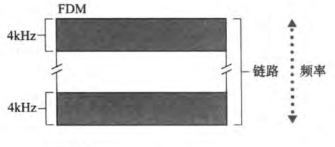
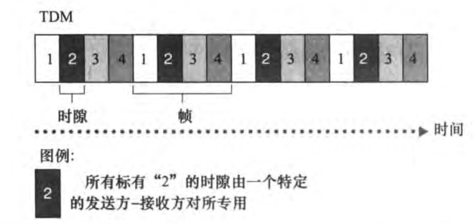

### 什么是Internet
#### 具体构成
Internet是一个世界范围的计算机网络，即它是一个互联了遍及全世界数十亿计算设备的网络。

端系统通过*通信链路*（communication link）和*分组交换机*（packet switch）连接到一起。

不同的链路能够以 不同的速率传输数据，链路的传输速率（transmission rate）以比特／秒（bills, 或 bps）度量。当一台端系统要向另一台端系统发送数据时，发送端系统将数据分段，并为每段加上首部字节。由此形成的信息包用计算机网络的术语来说称为分组（packet）。这些分组通过网络发送到目的端系统，在那里被装配成初始数据。

端系统通过**因特网服务提供商**（Internet Service Provider，ISP）接入因特网，包括如本地电缆或电话公司那样的住宅区ISP 、公司 ISP 、大学 ISP，在机场、旅馆、咖啡店和其他公共场所提供WiFi接人的ISP，以及为智能手机和其他设备提供移动接入的蜂窝数据ISP。每个ISP自身就是一个由多台分组交换机和多段通信链路组成的网络。

端系统、分组交换机和其他因特网部件都要运行一系列协议（protocol），这些协议控制因特网中信息的接收和发送。TCP（Transmission Control Protocol，传输控制协议）和IP（Internet Protocol，网际协议）是因特网中两个最重要的协议。IP协议定义了在路由器和端系统之间发送和接收的分组格式。

#### 服务描述
从为应用程序提供服务的基础设施的角度来描述因特网。除了诸如电子邮件和Web冲浪等传统应用外，因特网应用还包括移动智能手机和平板电脑应用程序，其中包括即时讯息、与实时道路流量信息的映射、来自云的音乐流、电影和电视流、在线社交网络、视频会议、多人游戏以及基于位置的推荐系统。因为这些应用程序涉及多个相互交换数据的端系统，故它们被称为**分布式应用程序**（distributed application）。重要的是，因特网应用程序运行在端系统上，即它们并不运行在网络核心中的 分组交换机中。尽管－分组交换机能够加速端系统之间的数据交换，但它们并不在意作为数据的源或宿的应用程序。

与因特网相连的端系统提供了一个套接字接口（socket interface），该接口规定了运行
在一个端系统上的程序请求因特网基础设施向运行在另一个端系统上的特定目的地程序交
付数据的方式。因特网套接字接口是一套发送程序必须遵循的规则集合，因此因特网能够
将数据交付给目的地。

#### 协议（protocol）
协议（protocol）定义了在两个或多个通信实体之间交换的报文的格式和顺序，以及报文发送和／或接收一条报文或其他事件所采取的动作。

### 网络边缘
端系统也称为主机（host），因为它们容纳（即运行）应用程序，如Web浏览器程序、Web服务器程序、电子邮件客户程序或电子邮件服务器程序等。本书通篇将交替使用主机和端系统这两个术语，即主机＝端系统。主机有时又被进一步划分为两类：客户（client）和服务器（server）。客户通常是桌面PC、移动 PC和智能手机等，而服务器通常是更为强大的机器，用于存储和发布 Web 页面、流视频、中继电子邮件等。今天，大部分提供搜索结果、电子邮件、Web 页面和视频的服务器都属于大型数据中心（datacenter）。

#### 接入网
指将端系统物理连接到其边缘路由器（edge router）的网络。边缘路由器是端系统到任何其他远程端系统的路径上的第一台路由器。

#### 物理媒体
- 导引型媒体（guide media）：对于导引型媒体，电波沿着固体媒体前进，如光缆、双绞铜线或同轴电缆。
- 非导引型媒体（unguide media）：对于非导引型媒体，电波在空气或外层空间中传播，例如在无线局域网或数字卫星频道中。

### 网络核心
#### 分组交换
在各种网络应用中，端系统彼此交换报文（message）。报文能够包含协议设计者需要的任何东西。报文可以执行一种控制功能，也可以包含数据，例如电子邮件数据、JPEG图像或MP3音频文件。为了从源端系统向目的端系统发送一个报文，源将长报文划分为较小的数据块，称之为分组（packet）。在源和目的地之间，每个分组都通过通信链路和分组交换机（packet switch）传送。（交换机主要有两类：路由器（router）和链路层交换机（link-layer switch））分组以等于该链路最大传输速率的速度传输通过通信链路。因此，如果某源端系统或分组交换机经过一条链路发送一个L比特的分组，链路的 传输速率为R比特/秒，则传输该分组的时间为L/R秒。

##### 存储转发传输
多数分组交换机在链路的输入端使用存储转发传输（store-and-forward transmission）机制。
存储转发传输是指在交换机能够开始向输出链路传输该分组的第一个比特之前，必须接收到整个分组。

通过由N条速率为R的链路组成的路径（所以，在源和目的地之间有N-1台路由器），从源到目的地发送一个分组。端到端时延为：d = NL/R

##### 排队时延和分组丢失
每台分组交换机有多条链路与之相连。对于每条相连的链路，该分组交换机具有一个输出缓存（output buffer，也称为输出队列（output queue）），它用于存储路由器准备发往那条链路的分组。该输出缓存在分组交换中起着重要的作用。如果到达的分组需要传输到某条链路，但发现该链路正忙于传输其他分组，该到达分组必须在输出缓存中等待。因此，除了存储转发时延以外，分组还要承受输出缓存的**排队时延**（queuing delay）。

因为缓存空间的大小是有限的，一个到达的分组可能发现该缓存已被其他等待传输的分组完全充满了。在此情况下，将出现**分组丢失（丢包）**（packet loss），到达的分组或已经排队的分组之一将被丢弃。

##### 转发表和路由选择协议
在因特网中，每个端系统具有一个称为IP地址的地址。当源主机要向目的端系统发送一个分组时，源在该分组的首部包含了目的地的IP地址。当一个分组到达网络中的路由器时，路由器检查该分组的目的地址的一部分，并向一台相邻路由器转发该分组。更特别的是，每台路由器具有一个**转发表**（forwarding table），用于将目的地址（或目的地址的一部分）映射成为输出链路。当某分组到达一台路由器时，路由器检查该地址，并用这个目的地址搜索其转发表，以发现适当的出链路。路由器则将分组导向该出链路。

#### 电路交换（circuit switching）
在电路交换网路中，在端系统间通信会话期间，预留了端系统间沿路径通信所需要的资源（缓存，链路传输速率）。在分组交换网络中，这些资源则不是预留的，会话的报文按需使用这些资源，其后果是不得不等待（即排队）接入通信线路。

##### 电路交换网络中的复用
链路中的电路是通过*频分复用*（Frequency-Division Multiplexing，FDM）或*时分复用*（Time-Division Multiplexing，TDM）来实现的。

对于FDM，链路的频谱由跨越链路创建的所有连接共享。特别是，在连接期间链路为每条连接专用一个频段。在电话网络中，这个频段的宽度通常为4kHz（即每秒4000周期）。毫无疑问，该频段的宽度成为**带宽**（band-width）。调频无线电台也使用FDM来共享88MHz~108MHz的频谱，其中每个电台被分配一个特定的频段。

对于一条TDM链路，时间被划分为固定区间的帧，并且每个帧又被划分为固定数量的时隙。当网络跨越一条链路创建一条连接时，网络在每个帧中为该连接指定一个时隙。这些时隙专门由该连接单独使用，一个时隙（在每个帧内）可用于传输该连接的数据。

### 分组交换网中的时延、丢包和吞吐量
#### 时延
分组从一台主机（源）出发，通过一系列路由器传输，在另一台主机（目的地）中结束它的历程。当分组从一个节点（主机或路由器）沿着这条这条路径到后继节点（主机或路由器），该分组在沿途的每个节点经受了几种不同类型的时延。这些时延为重要的是**节点处理时延**（nodal processing delay）、排队时延（queuing delay）、传输时延（transmission delay）和传播时延（propagation delay），这些时延总体累加起来是节点总时延（total nodal delay）。

##### 时延的类型
###### 处理时延
检查分组首部和决定将该分组导向何处所需要的时间是**处理时延**的一部分。处理时延也能够包括其他因素，如检查比特级别的差错所需要的时间，该差错出现在从上游节点向路由器A传输这些分组比特的过程中。高速路由器的处理时延通常是微秒或更低的数量级L在这种节点处理之后，路由器将该分组引向通往路由器B链路之前的队列。（在第 4章中，我们将研究路由器运行的细节。）

###### 排队时延
在队列中，当分组在链路上等待传输时，它经受排队时延。一个特定分组的排队时延长度将取决于先期到达的正在排队等待向链路传输的分组数量。如果该队列是空的，并且当前没有其他分组正在传输，则该分组的排队时延为0。另一方面，如果流量很大，并且许多其他分组也在等待传输，该排队时延将很长。我们将很快看到，到达分组期待发现的分组数量是到达该队列的流量的强度和性质的函数。实际的排队时延可以是毫秒到微秒量级。

###### 传输时延
假定分组以先到先服务方式传输这在分组交换网中是常见的方式，仅当所有已经到达的分组被传输后，才能传输刚到达的分组。用L比特表示该分组的长度，用R bps（即 b/s）表示从路由器A到路由器B的链路传输速率。例如，对于一条lOMbps的以太网链路，速率R=lOMbps；对于lOOMbps的以太网链路，速率R=lOOMbps。**传输时延**是L/R。这是将所有分组的比特推向链路（即传输，或者说发射）所需要的时间。 实际的传输时延通常在毫秒到微秒匮级 。

###### 传播时延
一旦一个比特被推向链路，该比特需要向路由器B传播。从该链路的起点到路由器B传播所需要的时间是**传播时延**。该比特以该链路的传播速率传播。该传播速率取决于该链路的物理媒体（即光纤、双绞铜线等），其速率范围是2x10^8 ~ 3x10^8m/s，这等于或略小于光速。该传播时延等于两台路由器之间的距离除以传播速率即传播时延是d/s，其中d是路由器A和路由器B之间的距离，s是该链路的传播速率） 一旦该分组的最后一个比特传播到节点B，该比特及前而的所有比特被存储于路由器B整个过程将随着路由器B执行转发而持续下去。在广域网中，传播时延为毫秒量级。

###### 传输时延和传播时延的区别
传输时延是路由器推出分组所需要的时间，它是分组长度和链路传输速率的函数，而与两台路由器之间的距离无关。另一方面，传播时延是一个比特从一台路由器传播到另一个路由器所需要的时间，它是两台路由器之间距离的函数，而与分组长度或链路传输速率无关。

##### 排队时延和丢包
令a表示分组到达队列的平均速率（a的单位是分组/秒，即pkt/s）。R是传输速率，即从队列中推出比特的速率（以bps即b/s为单位）。假定所有分组都是由L比特组成的。则比特到达队列的平均速率是La bps。最后，假定该队列非常大，因此它基本能容纳无限数量的比特。比率La/R被称为流量强度（traffic intensity），它在估计排队时延的范围经常起着重要的作用。如果La/R > 1，则比特到达队列的平均速率超过从该队列传输出去的速率。所以，==设计系统时流量强度不能大于1==

考虑La/R <= 1，这时，到达流量的性质影响排队时延。例如，如果分组周期性到达，即每L/R s到达一个分组，则每个分组将到达一个空队列中，因此不会有排队时延。另一方面，如果分组以突发形式到达而不是周期性到达，则可能有很大的平均排队时延。

因为排队容量是有限的，所以流量强度接近于1时排队时延也不会趋向于无穷大。相反，到达的分组将发现一个满的队列。由于没有地方存储这个分组，路由器将丢弃（drop）该分组，即该分组将会丢失（lost）。
从端系统的角度看，上述丢包现象看起来是一个分组已经传输到网络核心，但它绝不会从网络发送到目的地。分组丢失的比例随着流量强度增加而增加。因此，一个节点的性能常常不仅根据时延来度量，而且根据丢包的概念来度量

##### 计算机网络中的吞吐量
为了定义吞吐量，考虑从主机A到主机B跨越计算机网络传送一个大文件。例如，也许是从一个P2P文件共享系统中的一个对等方向另一个对等方传送一个大视频片段。在任何时间瞬间的**瞬时吞吐量**（instantaneous throughput）是主机B接收到该文件的速率（以bps计）

#### 协议层次和它们的服务模型
##### 协议分层
为了给网络协议的设计提供一个结构，网络设计者以分层（layer）的方式组织协议以及实现这些协议的网络硬件和软件。每个协议属于这些层次之一。我们关注某层向它的上一层提供的服务（service），即所谓一层的服务模型（service model）。
各层的所有协议被称为协议栈（protocol stack）。因特网的协议栈由5个层次组成：
- 应用层：应用层是网络应用程序及他们的应用层协议存留的地方。因特网的应用层包括许多协议，例如HTTP（它提供了Web文档的请求和传送）、SMTP（它提供了两个端系统之间的文件传送）和FTP（它提供了两个端系统之间的文件传送）。某些网络功能，如将像www.ietf.org这样对人友好的端系统名字转换为32比特的网络地址，也是借助于特定的应用层协议即域名系统（DNS）完成的。应用层协议分布在多个端系统上，而一个端系统中的应用程序使用协议与另一个端系统中的应用程序交换信息分组。我们将这种位于应用层的信息分组称为报文（message）。
- 运输层：因特网的运输层在应用程序端点之间传送应用层报文。在因特网中，有两种运输协议，即TCP和UDP，利用其中的任一个都能运输应用层报文。TCP向它的应用程序提供了面向连接的服务。这种服务包括了应用层报文向目的地的确保传递和流量控制（即发送方／接收方速率匹配）。TCP也将长报文划分为短报文，并提供拥塞控制机制，因此当网络拥塞时，源抑制其传输速率。UDP协议向它的应用程序提供无连接服务。这是一种不提供不必要服务的服务，没有可靠性，没有流量控制，也没有拥塞控制。我们把运输层的分组称为报文段(segment)。
- 网络层