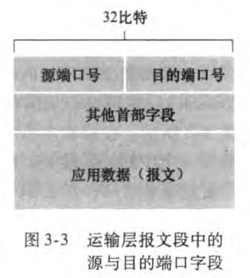
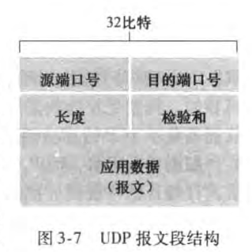
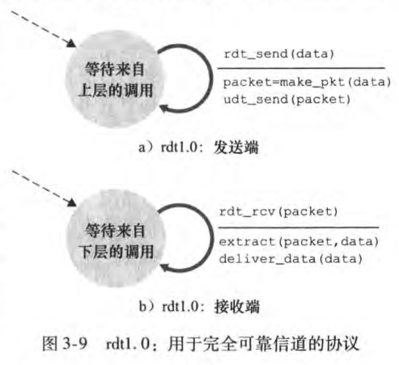
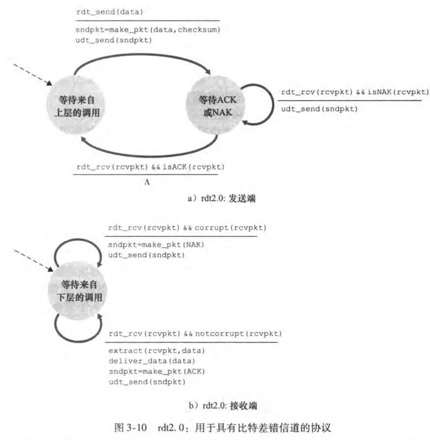
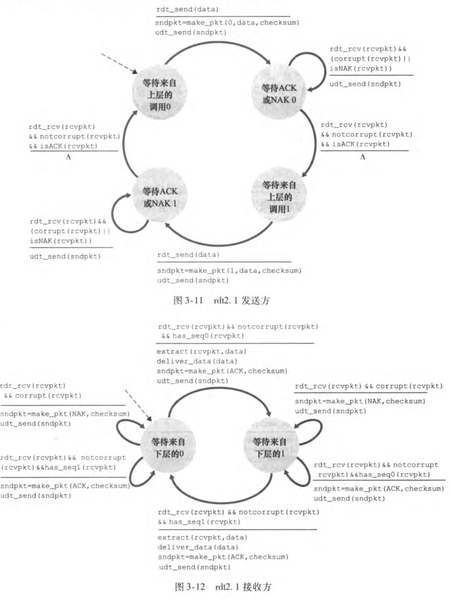
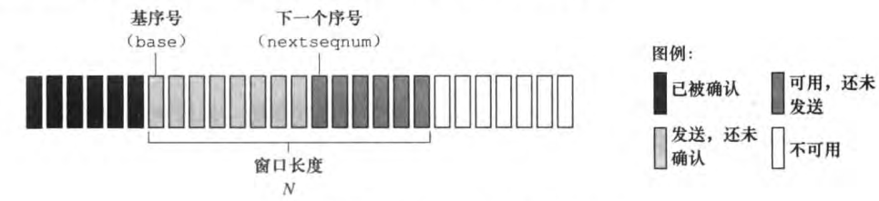
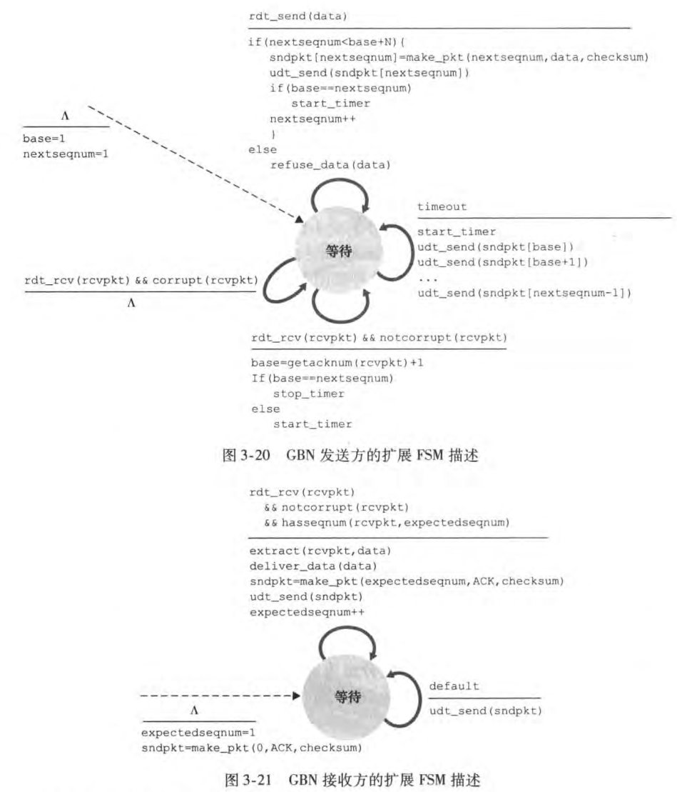

## 传输层

### 概述和运输层服务
运输层协议为运行在不同主机上的应用进程之间提供了**逻辑通信**（logic communication）功能。从应用程序的角度看，通过逻辑通信，运行不同进程的主机好像直接相连一样；实际上，这些主机可能位于地球的两侧，通过很多路由器及多种不同类型的链路相连。应用程序使用运输层提供的逻辑通信彼此发送报文，而无须承载这些报文的物理基础设施的细节。

运输层协议是在端系统中而不是在路由器中实现的。在发送端，运输层将从发送应用程序进程接收到的报文转换成运输层分组，用因特网术语来讲改分组称为*运输层报文段*（segment）。实现的方法（可能）是将应用报文划分为较小的块，并为每块加上一个运输层首部以生成运输层报文段。然后，在发送端系统中，运输层将这些报文段传递给网络层，网络层将其封装成网络层分组（数据报）并向目的地发送。

#### 运输层和网络层的关系
网络层提供了主机之间的逻辑通信，而运输层为运行在不同主机上的进程之间提供了逻辑通信。

#### 因特网运输层概述
- UDP（用户数据报协议）：为调用它的应用程序提供了一种不可靠、无连接的服务。
- TCP（传输控制协议）：为调用它的应用程序提供了一种可靠的、面向连接的服务。

因特网网络层协议由一个名字叫IP，即网际协议。IP为主机之间提供了逻辑通信。IP服务模型是尽力而为交付服务（best-effort delivery service）。这意味着IP尽它“最大的努力”在通信的主机之间交付报文段，但它不做任何确保。特别是，它不确保报文段的交付，不保证报文段的按序交付，不保证报文段中数据的完整性。由于这些原因，IP被称为不可靠服务（unreliable service）。

UDP和TCP最基本的任务是，将两个端系统将IP的交付服务拓展为运行在两个端系统上的进程之间的交付服务。将主机间交付拓展到进程间交付，称为运输层的多路复用与多路分解。UDP和TCP还可以在其报文段的首部中添加差错检测字段而提供完整性检查。进程间数据交付和差错检测是两种最低限度的运输层服务，也是UDP所能提供的仅有的两种服务。

和IP服务一样，UDP也是不可靠服务，即不能保证一个进程所发送的数据能够完整无损的到达目的进程。

TCP为应用进程提供**可靠数据传输**（reliable data transfer）。通过使用流量控制、序号、确认和定时器等技术，TCP确保正确地、按序地将数据从发送进程交付给接收进程。TCP还提供**拥塞控制**（congestion control），TCP拥塞控制防止任何一条TCP连接用过多流量来淹没通信主机之间的链路和交换设备。UDP流量是不可调节的，使用UDP传输的应用程序可以根据其需要以任何速率发送数据

### 多路复用和多路分解
- 多路分解（demultiplexing）：将运输层报文段中的数据交付到正确的套接字
- 多路复用（multiplxing）：从源主机的不同套接字中收集数据块，并为每个数据块封装上首部信息（这将在多路分解时使用）从而产生报文段，然后将报文段传递到网络层

运输层多路复用的要求：
- 套接字有唯一标识符
- 每个报文段有特殊字段来指示该报文段所要交付的套接字
    - 这些特殊字段是源端口号字段（source port number field）和目的端口号字段（destination port number field）

端口号是一个16比特的数字，其大小在0~65535之间。0~1023范围的端口号称为周知端口号（well-known port number），是受严格限制的。

主机上的每个套接字被分配一个端口号，当报文段到达主机时，运输层检查报文段中的目的端口号，并将其定向到相应的套接字。然后报文段中的数据通过套接字进入其所连接的进程。

#### 无连接的多路复用和多路分解
一个UDP套接字是由一个包含目的IP地址和目的端口号的二元组来全面标识的。因此，如果两个UDP报文段有不同的源IP和/或源端口号，但具有相同的目的IP地址和目的端口号，那么这两个报文段将通过相同的目的套接字定向到相同的目的进程。

#### 面向连接的多路复用和多路分解
TCP套接字是由一个四元组（源IP地址、源端口号、目的IP地址、目的端口号）来识别的。这样，当一个TCP报文段从网络到达一台主机时，主机使用全部4个值来将报文段定向（多路分解）到相应套接字。特别地，与UDP不同的是，两个具有不同源IP地址或源端口号的到达的TCP报文段将被定向到两个不同的套接字，除非TCP携带了初始创建连接的请求。

### 无连接服务：UDP
由RFC 768定义的UDP只是做了运输协议能够做的最少工作。除了多路复用和多路分解功能及一些轻型的差错检测外，它几乎没有对IP增加别的东西。注意到，使用UDP时，在发送报文段之前，发送方和接收方的运输层实体之间没有进行握手。正因如此，UDP被称为无连接的。

使用UDP的优点：
- 应用层能更好地控制要发送的数据和发送时间
- 无需建立连接
- 无连接状态
- 分组首部开销小：每个TCP报文段都有20个字节的首部开销，而UDP仅有8字节的开销

#### UDP报文段结构

UDP首部只有4个字段，每个字段有两个字节组成。通过端口号可以使目的主机将应用数据交给运行在目的端系统中的相应进程。接收主机使用检验和来检查报文段中是否存在差错。

#### UDP检验和
UDP检验和提供了差错检测功能，即检验和用于确定当UDP报文段从源到达目的时，其中的比特是否发生改变。发送方对报文段中所有16比特字的和进行反码运算，求和时遇到的任何溢出都被回卷。得到的结果放在UDP报文段中的检验和字段。在接收方，全部的4个16比特字（包括检验和）一起相加。如果分组中无差错，则在接收方这个和将是1111111111111111。如果有1个比特为0，那么分组中出现了差错。

虽然UDP提供了差错检测，但是它并不能进行差错恢复。

### 可靠数据传输的原理
提供给上层实体的服务实体是，数据可以通过一条可靠的信道进行传输。有了可靠信道，就不会有传输数据比特受到损坏（由0变为1，或者相反）或丢失，而且所有数据都是按照其发送顺序进行传送。这恰好就是TCP为调用它的因特网应用所提供的服务模型。

实现这种抽象服务的是**可靠数据传输协议**（reliable data transfer protocol）的责任。

- 单向数据传输（unidirectional data transfer）：数据传输是从发送方到接收方
- 双向数据传输（bidirectional data transfer）

#### 构造可靠数据传输协议
##### 完全可靠信道上的可靠数据传输：rdt1.0
考虑底层信道是完全可靠的。

##### 具有比特差错信道上的可靠数据传输：rdt2.0
更现实的底层信道模型是分组中的比特可能受损。
- 肯定确认（positive acknowledge，ACK）
- 否定确认（negative acknowledge，NAK）

这些请求报文使得接收方可以让发送方知道哪些内容被正确接收，哪些内容接收有误从而需要重传。在计算机网络环境中，基于这种重传机制的可靠数据传输协议称为**自动重传请求**（Automatic Repeat reQuest，ARQ）协议
ARQ协议中还需要另外三种协议来处理存在的比特差错：
- 差错检测：使接收方检测到何时出现了比特差错。
- 接收方反馈：因为发送方和接收方通常在不同端系统上执行，可能是相隔千里，发送方要了解接收方情况（即分组是否被正确接收）的唯一途径就是让接收方提供明确的反馈信息给发送方。
- 重传：接收方收到有差错的分组时，发送方将重传该分组。

发送方仅当接收到ACK并离开wait-for-ACK-or-NAK状态时，接收方才能继续获取数据。因此发送方不会发送一块新数据，知道发送方确信接收方已正确接收当前分组为止。这种行为，类似于rdt2.0的协议被称为**停等**（stop-and-wait）协议。

rdt2.0有一个缺陷：没有考虑到ACK或者NAK分组受损的可能性
解决方法：在数据分组中添加一新字段，让发送方对其数据分组编号，即将发送的数据分组的序号（sequence number）放在该字段。于是，接收方只需要检查序号即可确定收到的分组是否是一次重传。

rdt2.1使用了从接收方到发送方的肯定确认和否定确认。当接收到失序的分组时，接收方对所接收的分组发送一个肯定确认。如果收到受损的分组，接收方将发送一个否定确认。如果不发送NAK，而是发送一个对上次正确接收的分组的ACK，我们也能实现与NAK一样的效果。

发送方接收到对同一个分组的两次ACK（即接收冗余ACK，duplicate ACK）后，就知道接收方没有正确接收到跟在被确认两次的分组后面的分组。rdt2.2是在具有比特差错信道上实现的一个无NAK的可靠数据传输协议。rdt2.1和rdt2.2的区别在于，接收方必须包括由一个ACK报文确认的分组序号，发送方必须检查接收到的ACK报文中所确认的分组序号。

##### 具有比特差错的丢包信道上的可靠数据传输：rdt3.0
我们让发送方负责检测和恢复丢包。假定发送方传输一个数据分组，或者该分组或者接收方对改分组的ACK发生了丢失。在这两种情况下，发送方都接收不到应当到来的接收方的响应。如果发送方愿意等待足够长的时间以便确认分组已丢失，则只需重传该数据分组即可。
发送方至少需要等待发送方与接收方之间的一个往返时延（可能会包括在中间路由器的缓冲时延）加上接收方处理一个分组所需的时间。理想的协议应尽可能快地从丢包中理想地恢复出来，而等待一个最坏情况地时延可能意味着要等待一段比较长的时间，知道启动差错恢复为止。
注意到如果一个分组经历了一个特别大的时延，发送方可能会重传该分组，即使该数据分组或ACK都没有丢失。这就在发送方到接收方的信道中引入了冗余数据分组（duplicate data packet）的可能性。

发送方需要能做到：
1. 每次发送一个分组（即第一次分组和重传分组）时，便启动一个定时器
2. 响应定时器中断（采取适当的动作）
3. 终止定时器

因为分组序号在0和1之间交替，因此rdt3.0有时被称为比特交替协议（alternating-bit protocol）

#### 流水线可靠数据传输协议
rdt3.0性能问题的一个核心在于它是一个stop-and-wait协议。
- 发送缓冲区：
    - 形式：内存中的一个区域，落入缓冲区的分组可以发送
    - 功能：用于存放已发送、但是没有得到确认的分组
    - 必要性：需要重发时可用
- 发送缓冲区的大小：一次最多可以发送多少个未经确认的分组
    - 停止等待协议=1
    - 流水线协议>1，合理的值，不能很大，链路利用率不能超过100%
- 发送缓冲区中的分组
    - 未发送的：落入发送缓冲区的分组，可以连续发送出去
    - 已经发送出去的、等待对方确认的分组：发送缓冲区的分组只有得到确认才能删除

#### GBN
**回退N步**（GBN）协议中，允许发送方发送多个分组（当有多个分组可用时）而不需等待确认，但它也受限于在流水线中未确认的分组数不能超过某个最大允许数N。
GBN也被称为发动窗口协议（sliding-window protocol）

我们将基序号（base）定义为最早未确认分组的序号，将下一个序号（nextseqnum）定义为最小的未使用序号（即下一个待发分组的序号），则可将序号范围分割为4段。在[0, base-1]段内的序号对应于已经发送并被确认的分组。[base, nextseqnum-1]段内对应已经发送但未被确认的分组。[nextsequnm, base+N-1]段内的序号能用于那些要被立即发送的分组，如果有数据来自上层的话。最后，大于或等于base+N的序号是不能使用的，直到当前流水线中未被确认的分组（特别是序号为base的分组）已得到确认为止。

那些已被发送但还未被确认的分组的许可序号范围可以被看成是一个在序号范围内长度为N的窗口。随着协议的运行，该窗口在序号空间向前滑动。N常被称为窗口长度（window size）

#### 选择重传
