### 链路层概述
将运行链路层协议的任何协议的任何设备称为**节点**（node）。节点包括主机、路由器、交换机和WiFi接入点。我们也把沿着通信路径连接相邻节点的通信信道称为链路（link）。为了将一个数据报从源主机传输到目的主机，数据报必须通过沿端到端路径上的各段链路传输。
在通过特定的链路时，传输节点将数据报封装在链路层帧中，并将该帧传送到链路中。

####  链路层提供的服务
链路层的基本服务都是将数据报通过单一通信链路从一个节点移动到相邻节点。
链路层协议能够提供的可能服务包括：
- 成帧（framing）：在每个网络层数据报仅链路传送之前，几乎所有的链路层协议都要将其用链路层帧封装起来。一个帧由一个数据字段和若干首部字段组成，其中网络层数据报就插在数据字段中。
- 链路接入：**媒体访问控制**（Medium Access Control，MAC）协议规定了帧在链路上传输的规则。
- 可靠交付：当链路层协议提供可靠交付服务时，它保证无差错地经链路层移动每个网络层数据报。
- 差错检测和纠正：当帧中的一个比特作为1传播时，接收方节点中的链路层硬件可能不正确地将其判断为0，反之亦然。

#### 链路层在何处实现
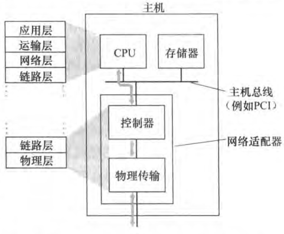
链路层的主体部分在**网络适配器**（network adapter）中实现的，网络适配器有时也称为**网络接口卡**（Network Interface Card，NIC）。位于网络适配器核心的是链路层控制器，该控制器通常是一个实现了许多链路层服务的专用芯片。

### 差错检测和纠正技术
在发送节点，为了保护比特免受差错，使用**差错检测和纠正比特**（EDC）来增强数据D。通常，要保护的数据不仅包括从网络层传递下来的需要通过链路传输的数据报，而且包括链路帧首部中的链路级的寻址信息、序号和其他字段。链路级帧中的D和EDC都被发送到接收节点。
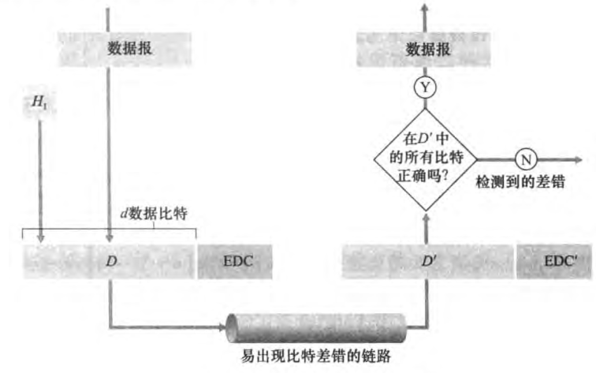

#### 奇偶校验
差错检测最简单的方式就是用单个奇偶校验位（parity bit）。假设要发送的信息D有d比特。在偶校验方案中，发送方只需包含一个附加的比特，选择它的值，使得这d+1比特（初始信息加上一个校验比特）中的1的总数是偶数。对于奇校验方案，选择校验比特值使得有奇数个1。
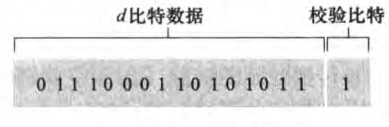
接收方只需数出接收的d+1比特中1的数目即可。如果在采用偶校验方案中发现了奇数个值为1的比特，接收方知道至少出现了一个比特差错。

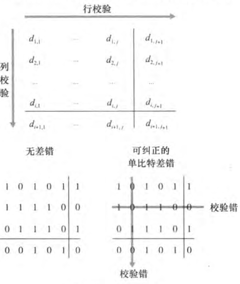
上图显示了单比特校验方案的二维一般化方案。这里D中的d个比特被划分为i行j列。对每行和每列计算奇偶值。产生的i+j+1奇偶比特构成了链路层帧的差错检测比特。
现在假设在初始d比特信息中出现了单个比特差错。使用这种二维奇偶校验（two-dimensional parity）方案，包含比特值改变的列和行的校验值都将会出现差错。因此接收方不仅可以检测到出现了单个比特差错的事实，而且还可以利用存在奇偶校验差错的列和行的索引来实际识别发生差错的比特并纠正它。
接收方检测和纠正差错的能力被称为**前向纠错**（Forward Error Correction，FEC）。

#### 检验和方法
**因特网检验和**（Internet checksum）就基于这种方法，即数据的字节作为16比特的整数对待并求和。这个和的反码形成了携带在报文段首部的因特网检验和。接收方通过对接收的数据（包括检验和）的和取反码，并检测其结果是否为全1比特来检测检验和。如果这些比特中有任何比特是0，就可以指示出差错。

#### 循环冗余检测
**循环冗余检测**（Cycle Redundancy Check，CRC）编码。CRC编码也称为**多项式编码**（polynomial code），因为该编码能够将要发送的比特串看作为系数是0和1一个多项式，对比特串的操作被解释为多项式算术。
CRC编码操作如下。考虑d比特的数据D，发送节点要将它发送给接收节点。发送方和接收方首先必须协商一个r+1比特模式，称为**生成多项式**（generator），我们将其表示为G。我们将要求G的最高有效位的比特（最左边）是1。
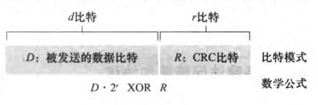
对于一个给定的数据段D，发送方要选择r个附加比特R，并将它们附加到D上，使得得到的d+r比特模式用模2算术恰好能被G整除（没有余数）。
用CRC进行差错检测的过程也很简单：接收方用G去除接收到d+r比特。如果余数为非零，接收方知道出现了差错；否则认为数据正确而被接收。
所有CRC计算采用模2算术来做，在加法中不进位，在减法中不借位。这意味着加法和减法是相同的，而且这两种操作等价于操作数的按位异或（XOR）。例：
1011 XOR 0101 = 1110
类似的：1011 - 0101 = 1110

在通常的二进制算法中，乘以$2^k$就是以一种比特模式左移k个位置。所以，给定D和R，$D·2^r XOR   R$产生上图所示的d+r比特模式。

我们要求R使得对于n来说有：
$$
D·2^r XOR R = nG
$$

例：原始数据D为101110，生成多项式G为1001：
![[images/Pasted image 20250610224317.png]]

### 多路访问链路和协议
**点对点链路**（point-to-point link）由链路一端的单个发送方和链路另一端的单个接收方组成。许多链路层协议都是为点对点链路设计的，如点对点（point-to-point protocol，PPP）和高级数据链路控制（high-level data link control，HDLC）。
第二种类型的链路是**广播链路**（broadcast link），它能够让多个发送和接收节点都连接到相同的、单一的、共享的广播信道上。
**多路访问问题**（multiple access problem）：如何协调多个发送和接收节点对一个共享广播信道的访问。
计算机网络广播信道上的节点既能够发送也能够接收。

**多路访问协议**，即节点通过这些协议来规范它们在共享的广播信道上的传输行为。
因为所有的节点都能够传输帧，所以多个节点可能会同时传输帧。当发生这种情况时，所有节点同时接到多个帧；这就是说，传输的帧在所有的接收方处碰撞（collide）了。通常，当碰撞发生时，没有一个接收节点能够有效地获得任何传输的帧；在某种意义下，碰撞帧的信号纠缠在一起。因此，涉及此次碰撞的所有帧都丢失了，在碰撞时间间隔中的广播信道被浪费了/

我们将任何多路访问协议分为3种类型之一：
- 信道划分协议（channel partitioning protocol）
- 随机接入协议（random access protocol）
- 轮流协议（taking-turns protocol）

假设：在理想情况下，对于速率为R bps的广播信道，多路访问协议应该具有以下所希望的特性：
- 当仅有一个节点发送数据时，该节点具有R bps的吞吐量
- 当有M个节点发送数据时，每个节点吞吐量为R/M bps。这不必要求M个节点中的每一个节点总是R/M的瞬间速率，而是每个节点在一些适当定义的时间间隔内应该有R/M的平均传输速率
- 协议是分散的；这就是说不会因某主节点故障而使整个系统崩溃
- 协议是简单的，使实现不昂贵

#### 信道划分协议
时分多路复用（TDM）和频分多路复用（FDM）是两种能够用于在所有共享信道节点之间划分广播信道带宽的技术。
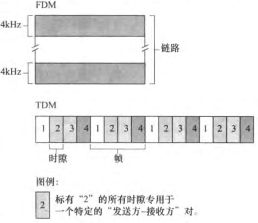
假设一个支持N个节点的信道且信道的传输速率为R bps。TDM将时间划分为时间帧（time frame），并进一步划分每个时间帧为N个时隙（slot）。然后把每个时隙分配给N个节点的一个。无论何时某个节点在有分组要发送的时候，他在循环的TDM帧中指派给它的时隙内传输分组比特。
一个采用TDM规则的鸡尾酒会将允许每个聚会客人在固定的时间段发言，然后再允许另一个聚会客人发言同样时长，以此类推。一旦每个人都有了说话机会，将不断重复着这种模式。

每个节点在每个帧时间内得到了专用的传输速率R/N bps。但是TDM有两个主要缺陷：
- 节点被限制于R/N bps的平均速率，即使当它是唯一有分组要发送的节点时。
- 节点总是等待它在传输序列中的轮次，即使它是唯一一个有帧要发送的节点。

FDM将R bps信道划分为不同的频段（每个频段具有R/N带宽），并把每个频率分配给N个节点中的一个。因此FDM在单个较大的R bps信道中创建了N个较小的R/N bps信道。FDM也有TDM同样的优点和缺点。它避免了碰撞，在N个节点之间公平划分了带宽。但是它限制了一个节点只能使用R/N的带宽，即使它是唯一一个有分组要发送的节点。

第三种信道划分协议是**码分多址**（Code Division Multiple Access，CDMA）。TDM和FDM分别是节点分配时隙和频率，而CDMA对每个节点分配一种不同的编码。然后每个节点用它唯一的编码来对它发送的数据进行编码。

#### 随机接入协议
在随机接入协议中，一个传输节点总是以信道的全部速率（R bps）进行发送。当有碰撞时，涉及碰撞的每个节点反复地重发它的帧，到该帧无碰撞地通过为止。但是当一个节点经历一次碰撞时，它不必立刻重发该帧。相反，它在重发该帧之前等待一个随机时延。涉及碰撞的每个节点独立地选择随机时延。

##### 时隙ALOHA
做下列假设：
- 所有帧由L比特组成
- 时间被划分成长度为L/R秒的时隙（一个时隙等于传输一帧的时间）
- 节点只在时隙起点开始传输帧
- 节点是同步的，每个节点都知道时隙何时开始
- 如果在一个时隙中有两个或者更多个帧碰撞，则所有节点在该时隙结束之前检测到该碰撞事件

令p是一个概率。在每个节点中，时隙ALOHA的操作是简单的：
- 当节点有一个新帧要发送时，它等到下一个时隙开始并在该时隙传输整个帧
- 如果没有碰撞，该节点成功地传输它的帧，从而不需要考虑重传该帧
- 如果有碰撞，该节点在时隙结束之前检测到这次碰撞。该节点以概率p在后续的每个时隙中重传它的帧，直到该帧被无碰撞地传输出去。

与信道划分不同，当某节点是唯一活跃的节点时（一个节点如果有帧要发送就认为它是活跃的），时隙ALOHA允许该节点以全速R连续传输。时隙ALOHA也是高度分散的，因为每个节点检测碰撞并独立地决定在什么时候重传。

刚好有一个节点传输地时隙称为一个**成功时隙**（successful slot）。时隙多路访问协议的效率（efficiency）定义为：当有大量的活跃节点且每个节点总有大量的帧要发送时，长期运行中成功时隙的份额。

##### ALOHA
时隙ALOHA协议要求所有的节点同步它们的传输，以在每个时隙开始时开始传输。第一个ALOHA协议实际上是一个非时隙、完全分散的协议。在纯ALOHA中，当一帧首次到达，节点立即该帧完整地传输进广播信道。如果一个传输的帧与一个或多个传输经历了碰撞，这个节点立即以概率p重传该帧。否则该节点等待一个帧传输事件。在此等待之后，它则以概率p传输该帧，或者以概率1-p在另一个帧时间等待。
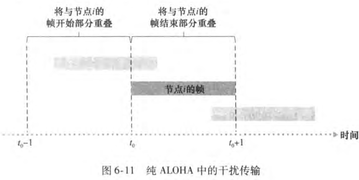

##### 载波侦听多路访问（CSMA）
在时隙和纯ALOHA中，一个节点传输的决定独立于连接到这个广播信道上的其他节点的活动。特别是一个节点不关心在它开始传输时是否有其他节点碰巧在传输，而且即使有另一个节点开始干扰它的传输也不会停止传输。

- **载波侦听**（carrier sensing）：一个节点在传输前先听信道。如果来自另一个节点的帧正向信道上发送，节点则等待直到检测到一小段时间没有传输，然后开始传输。
- **碰撞检测**（collision detection）：当一个传输节点在传输时一直在侦听此信道。如果它检测到另一个节点正在传输干扰帧，它就停止传输，在重复“侦听-当空闲时传输”循环之前等待一段随机时间

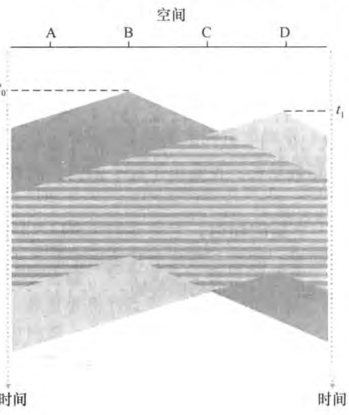
在时刻t0，节点B侦听到信道是空闲的，因此，节点B开始传输，沿着广播媒体在两个方向上传播它的比特。在时刻t1节点D有一个帧要发送，尽管节点B在时刻t1正在传输，但B传输的比特还没有到达D，因此D在t1侦听到信道空闲。根据CSMA协议，D开始传输它的帧，显然广播信道的端到端信道传播时延（channel propagation delay）（信号从一个节点传播到另一个节点的时间）在决定其性能方面起着关键作用。

##### 具有碰撞检测的载波侦听多路访问（CSMA/CD）
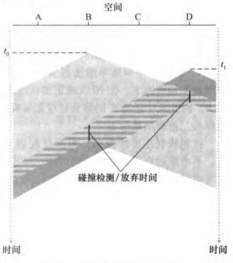
两个节点在检测到碰撞后很短的时间内都放弃了它们的传输。

运行步骤：
1. 适配器从网络层获得一条数据报，准备链路层帧，并将其放入帧适配器缓存中。
2. 如果适配器侦听到信道空闲（无信号能量从信道进入适配器），它开始传输帧。在另一方面，如果适配器侦听到信道正在忙，它将等待，直到侦听到没有信号能量时才开始传输帧。
3. 在传输过程中，适配器监视来自其他使用该广播信道的适配器的信号能量的存在。
4. 如果适配器传输整个帧而未检测到来自其他适配器的信号能量，该适配器就完成了该帧。在另一方面，如果适配器在传输时检测到来自其他适配器的信号能量，它中止传输
5. 中止传输后，适配器等待一个随机时间量，然后返回步骤2

#### 轮流协议
轮流协议（taking-turns protocol）

**轮询协议**（polling protocol）：轮询协议要求这些节点之一要被指定为主节点。主节点以循环的方式轮询每个节点。特别是，主节点首先向节点1发送一个报文，告诉它（节点1）能够传输的帧的最多数量。在节点1传输了某些帧后，主节点高速节点2能够传输的帧的最多数量。主节点能够通过观察在信道上是否缺乏信号，来决定一个节点何时完成了帧的发送。

轮询协议的缺点：
- 协议引入了轮询时延，即通知一个节点“它可以传输”所需的时间。
- 当主节点有故障时，整个信道都变得不可操作

**令牌传递协议**（token-passing protocol）：在这种协议中没有主节点，一个称为令牌（token）的小的特殊的帧在节点之间以某种固定的次序进行交换。当一个节点收到令牌时，仅当它有一些帧要发送时，它才持有这个令牌；否则，它立即向下一个节点转发该令牌。当一个节点收到令牌时，如果它确实有帧要传输，它发送最大数目的帧数，然后把令牌转发给下一个节点。
令牌传递时分散的，并有很高的效率。

### 交换局域网
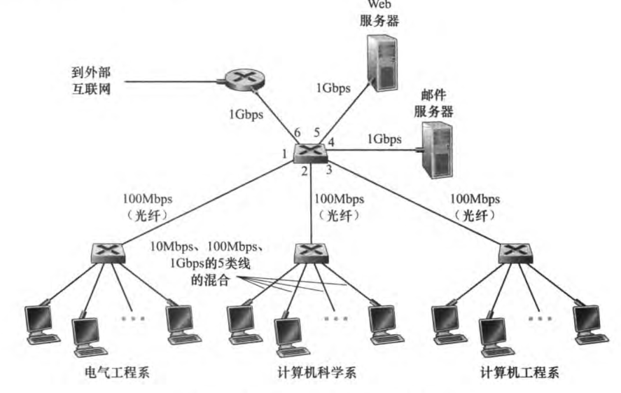

#### 链路层寻址和APP
主机和路由器具有链路层地址

##### MAC地址
事实上，并不是主机或路由器具有链路层地址，而是他们的适配器（网络接口）具有链路层地址。
因此，具有多个网络接口的主机或路由器将具有与之相关联的多个链路层地址，就像它也具有与之相关联的多个IP地址一样。但是，链路层交换机并不具有与它们的接口相关联的链路层地址，这是因为链路层交换机的任务是在主机和路由器之间承载数据报。

链路层地址有各种不同的称呼：
- LAN地址（LAN address）
- 物理地址（physical address）
- MAC地址（MAC address）

对于大多数局域网而言，MAC地址长度为6字节，共有2^48个可能的MAC地址。这些6字节地址通常用十六进制表示法，地址的每个字节被表示为一对十六进制数。
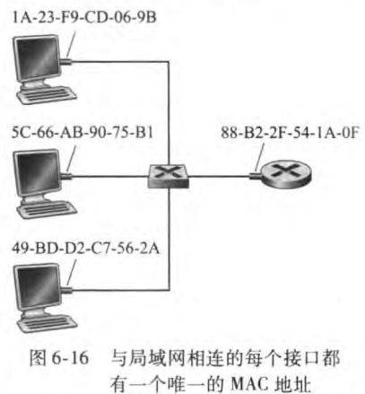

MAC地址的性质是没有两块适配器具有相同的地址。

适配器的MAC地址具有扁平结构，而且不论适配器到哪里用都不会变化。带有以太网接口的便携机总具有同样的MAC地址，无论该计算机位于何方。

当某适配器要向某些目的适配器发送一个帧时，发送适配器将目的适配器的MAC地址插入到该帧中，并将该帧发送到局域网上。一台交换机偶尔将一个入帧广播到它的所有接口。因此一块适配器可以接收一个并非向他寻址的帧。这样，当适配器接收到一个帧时，将检查该帧中的目的MAC地址是否与它自己的MAC地址匹配。如果匹配，该适配器提取出封装的数据报，并将该数据报沿协议栈向上传递。如果不匹配，该适配器丢弃该帧，而不会向上传递该网络层数据报。所以，仅当收到该帧时，才会中断目的地。
然而，有时某发送适配器的确要让局域网上所有其他适配器来接收并处理它打算发送的帧。在这种情况下，发送适配器在该帧的目的地址字段中插入一个特殊的MAC广播地址（broadcast address）。对于使用6字节的局域网来说，广播地址是48个连续的1组成的字符串（即以十六进制表示法表示的FF-FF-FF-FF-FF-FF）。

##### 地址解析协议
因为存在网络层地址（如因特网的IP地址）和链路层地址（MAC地址），所以需要在它们之间进行转换。对于因特网而言，这是**地址解析协议**（Address Resolution Protocol，ARP）的任务。

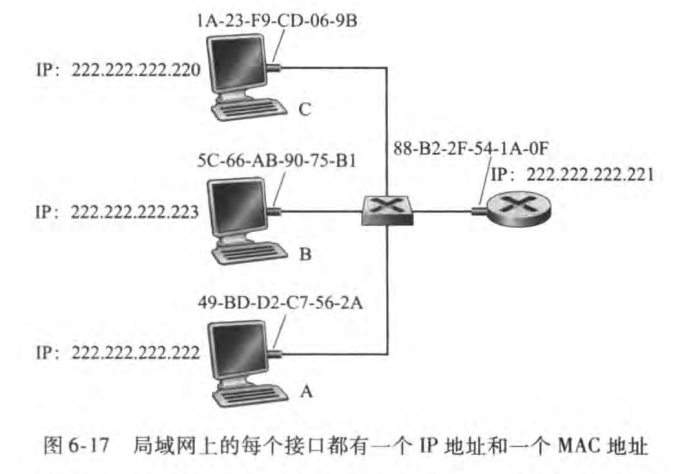
ARP和DNS很像，DNS将主机名解析为IP地址，ARP将一个IP地址解析为一个MAC地址。
DNS为在因特网中任何地方的主机解析主机名，而ARP只为在同一个子网上的主机和路由器接口解析IP地址。

每台主机或路由器在器内存中具有一个ARP表（ARP table），这张表包含IP地址到MAC地址的映射关系。
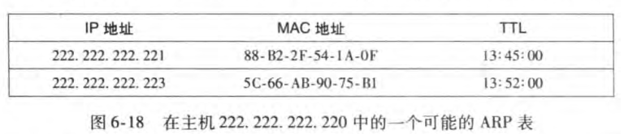
该ARP表也包含一个寿命（TTL）值，它指示了从表中删除每个映射的时间。

当ARP表中没有目的主机的表项：在这种情况下，发送方用ARP协议来解析这个地址。首先，发送方构造一个称为ARP分组（ARP packet）的特殊分组。一个ARP分组有几个字段，包括发送和接收IP地址及MAC地址。ARP查询分组和响应分组都具有相同的格式。ARP查询分组的目的是询问子网上所有其他主机和路由器，以确定对应于要解析的IP地址的那个MAC地址。

查询ARP报文在广播帧中发送，而响应ARP报文在一个标准帧中发送。
ARP是即插即用的，一个ARP表是自动建立的，它不需要系统管理员来配置。如果某主机与子网断开连接，它的表项最终会从留在子网中的节点的表中删除掉。

##### 发送数据报到子网以外
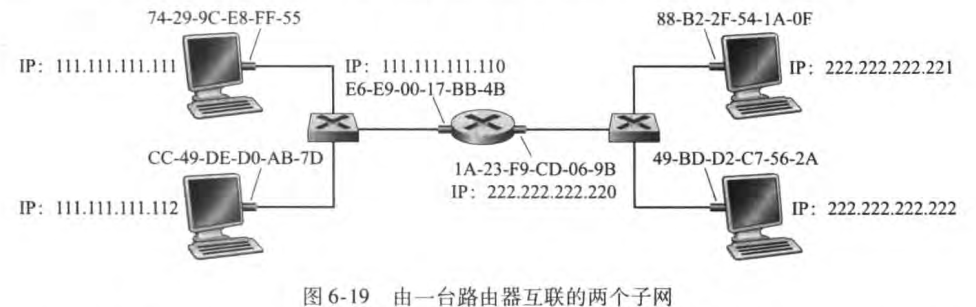
每台主机仅有一个IP地址和一个适配器。一台路由器对他的每个接口都有一个IP地址。对路由器的每个接口，在路由器中也有一个ARP模块和一个适配器。网络中的每个适配器都有自己的MAC地址。

子网1上的主机要向子网2中的一台主机发送一个IP数据报，发送主机需要向它的适配器指示路由器接口的MAC地址，将数据报从主机传递到路由器，然后路由器通过转发表将数据报转发到适当的接口，然后该接口把数据报传递给它的适配器，适配器把该数据报封装在一个新的帧中，并且将帧发送进子网2中。这时，该帧的目的MAC地址确实是最终目的MAC地址。

#### 以太网
##### 以太网帧结构
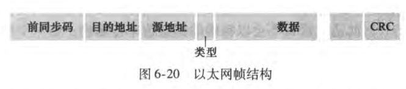
考虑从一台主机向另一台主机发送一个IP数据报，且这两台主机在相同的以太局域网上。设发送适配器的MAC地址为AA-AA-AA-AA-AA-AA，接收适配器的MAC地址为BB-BB-BB-BB-BB-BB。发送适配器在一个以太网帧中封装了一个IP数据报，并把该帧传递到物理层。接收适配器从物理层收到这个帧，提取出IP数据报，并将该IP数据报传递给网络层。
- 数据字段（46~1500字节）：这个字段承载了IP数据报。以太网的最大传输单元（MTU）是1500字节。这意味着如果IP数据报超过了1500字节，则主机必须将该数据报分片。
- 目的地址（6字节）：这个字段包含目的适配器的MAC地址。
- 源地址（6字节）：这个字段包含了传输该帧到局域网上的适配器的MAC地址。
- 类型字段（2字节）：类型字段允许以太网复用多种网络层协议。
- CRC（4字节）：CRC（循环冗余检测）字段的目的是使得接收适配器检测帧中是否引入了差错
- 前同步码（8字节）：以太网帧以一个8字节的前同步码（Preamble）字段开始。该前同步码的前7字段都是10101010；最后一个字节是10101011。前同步码字段的前7字节用于“唤醒”接收适配器，并且将他们的时钟和发送方的时钟同步。

所有的以太网技术都向网络层提供无连接服务。
以太网技术都向网络层提供不可靠服务。

#### 链路层交换机
交换机的任务是接收入链路层帧并将它们转发到出链路。
交换机自身对子网中的主机和路由器是**透明的**（transport）。某主机/路由器向另一个主机/路由器寻址一个帧，顺利地将该帧发送进局域网，并不知道某交换机将会接收该帧并将他转发到另一个节点。

##### 交换机转发和过滤
**过滤**（filtering）是决定一个帧应该转发到某个接口还是应当将其丢弃的交换机功能。
**转发**（forwarding）是决定一个帧应该导向哪个接口，并把该帧移动到那些接口的交换机功能。
交换机的过滤和转发借助于**交换机表**（switch table）完成。该交换机表包含某局域网上某些主机和路由器的但不是全部的表项。交换机表中的一个表项包括：
- 一个MAC地址
- 通向该MAC地址的交换机接口
- 表项放置在表中的时间

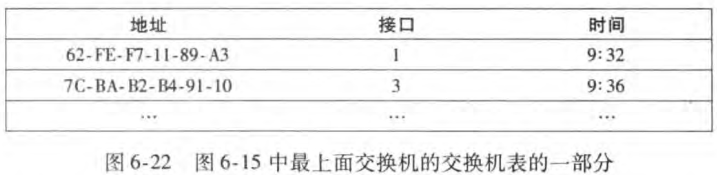

假定目的地址为DD-DD-DD-DD-DD-DD的帧从交换机接口x到达。交换机用MAC地址DD-DD-DD-DD-DD-DD索引它的表。可能出现的情况：
- 表中没有这个表项。在这种情况下，交换机向除接口x外的所有接口前面的输出缓存转发该帧的副本。换言之，如果没有对于目的地址的表项，交换机广播该帧。
- 表中有一个表项将DD-DD-DD-DD-DD-DD与接口x联系起来。在这种情况下，该帧从包括适配器DD-DD-DD-DD-DD-DD的局域网网段到来。无须将该帧转发到任何其他接口，交换机通过丢弃该帧执行过滤功能即可。
- 表中有一个表项将DD-DD-DD-DD-DD-DD与接口y联系起来。在这种情况下，该帧需要被转发到与接口y相连的局域网网段。交换机通过将该帧放在接口y前面的输出缓存完成转发功能。

##### 自学习
交换机的表是自动、动态和自治地建立的，没有来自网络管理员或来自配置协议的任何干预。
交换机是**自学习**（self-learning）的。
- 交换机表初始为空
- 对于在每个接口接收到的每个入帧，该交换机在其表中存储：
    - 在该帧源地址字段中的MAC地址
    - 该帧到达的接口
    - 当前时间
- 如果在一段时间（老化期（aging time））后，交换机没有接收到该地址作为源地址的帧，就在表中删除这个地址。以这种方式，如果一台PC被另一台PC（具有不同适配器）代替，原来PC的MAC地址将最终从该交换机表中被清除掉。
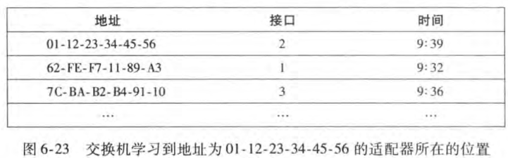

##### 链路层交换机的性质
- 消除碰撞：在使用交换机构建的局域网中，没有因碰撞而浪费的带宽。交换机缓存帧并且绝不会再网段上同时传输多余一个帧。交换机的最大聚合带宽是该交换机所有接口速率之和。
- 异质的链路：交换机将链路彼此隔离，因此局域网中的不同链路能够以不同的速率运行，并且能够在不同的媒体上运行。
- 管理：除了提供强化的安全性，交换机也易于进行网络管理。

##### 交换机与路由器比较
交换机是第二层的分组交换机，而路由器是第三层的分组交换机。

#### 虚拟局域网
**虚拟局域网**（Virtual Local Network，VLAN）。
支持VLAN的交换机允许经一个单一的物理局域网基础设施定义多个虚拟局域网。在一个VLAN内的主机彼此通信，仿佛它们与交换机连接。在一个基于端口的VLAN中，交换机的端口（接口）由网络管理员划分为组。每个组构成一个VLAN，在每个VLAN中的端口形成一个广播域。
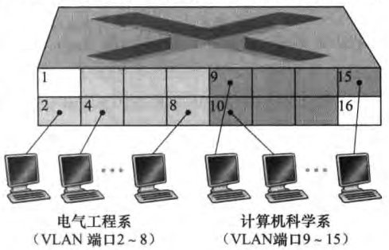
