### 转发和选路
- 转发：当一个分组到达某路由器的一条输入链路时，该路由器必须将该分组移动到适当的输出链路
- 选路：当分组从发送方流向接收方时，网络层必须决定这些分组所采用的路由或路径。计算这些路径的算法被称为选路算法（routing algorithm）

每台路由器都具有一张**转发表**（forwarding table）。路由器通过检查到达分组首部中的一个字段的值，然后使用该值在该路由器的转发表中索引查询来转发一个分组。查询转发表的结果是分组将被转发的路由器的链路接口。

**分组交换机**是指一台通用分组交换设备，它根据分组首部字段中的值，从输入链路接口到输出链路接口传送分组。某些分组交换机称为链路层交换机（link-layer switch），它们基于链路层字段中的值作转发决定。其他分组交换机称为路由器（router），它们基于网络层字段中的值作转发决定。

### 网络服务模型
网络服务模型（network service model）定义网络的一侧边缘到另一侧边缘之间（即发送端系统与接收端系统之间）分组的端到端运输特性。

在发送主机中，当运输层向网络层传递一个分组时，能由网络层提供的特定服务包括：
- 确保交付：该服务确保分组将最终到达其目的地
- 具有时延上界的确保交付：该服务不仅确保分组的交付，而且在特定的主机到主机时延上界内（如100ms内）交付。
- 有序分组交付：该服务确保分组以它们被发送的顺序到达目的地
- 确保最小带宽：这种网络层服务模仿在发送主机和接收主机之间（即使实际的端到端路径可能跨越几条物理链路）一条特定比特率（例如1Mbps）的传输链路的行为。只要发送主机以低于特定比特率的速率传输比特（作为分组的一部分），分组就不会丢失，且每个分组会在预定的主机到主机时延内（如40ms内）到达
- 确保最大时延抖动：该服务确保发送方发送的两个相继分组之间的时间量等于在目的地接收到它们之间的时间量（或这种间隔的变化不超过某些特定的值）
- 安全性服务

因特网的网络层提供了单一的服务，称为尽力而为服务（best-effort service）。使用尽力而为服务，分组间的定时是得不到保证的，分组接受的顺序也不能保证与发送的顺序一致，传送的分组也不能保证最终交付。

ATM服务模型：
- 恒定比特率（CBR）ATM网络服务
- 可用比特率（ABR）ATM网络服务

### 虚电路和数据报网络
仅在网络层提供连接服务的计算机网络称为**虚电路**（Virtual-Circuit，VC）网络
仅在网络层提供无连接服务的计算机网络称为**数据报网络**（datagram network）

#### 虚电路网络
因特网是数据报网络
许多其他网络体系结构（ATM、帧中继等）都是虚电路网络，因此在网络层使用连接。

#### 数据报网络
在数据报网络中，每当一个端系统要发送分组时，它就为该分组加上目的地端系统的地址，然后将该分组推进网络中。
随着分组从源向目的地传输，它通过一系列路由器。这些路由器中的每个都使用该分组的目的地来转发该分组。特别是，每台路由器有一个将目的地址映射到链路接口的转发表；当分组到达路由器时，该路由器使用该分组的目的地址在该转发表中查找适当的输出链路接口。然后，路由器有意识地将该分组向该输出链路接口转发。

### 路由器工作原理
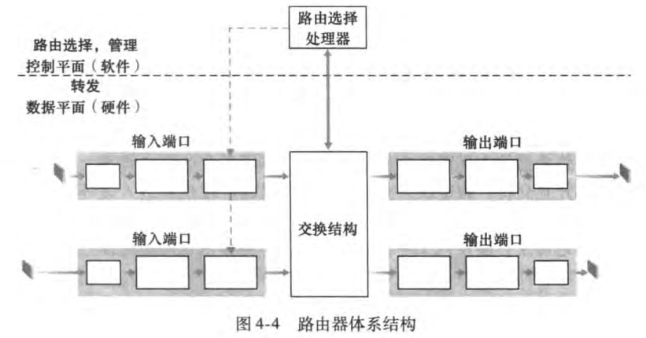
- 输入端口：执行将一条输入的物理链路端接到路由器的物理层功能。也要执行需要与位于入端口远端的数据链路层功能交互的数据链路层功能。还要完成查找与转发功能，以便转发到路由器交换结构部分的分组能出现在适当的输出端口。控制分组从输入端口转发到选路处理器。
- 交换结构
- 输出端口
- 选路处理器：选路处理器执行选路协议，维护选路信息与转发表，并执行路由器中的网络管理功能

#### 输入端口
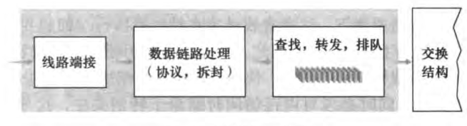
在许多路由器中都是在输入端口处来确定一个到达的分组经交换结构转发给哪个输出端口。通常一份转发表的拷贝会被存放到每个输入端口，而且会被更新。
在输入端口处理能力受限制的路由器中，输入端口也许直接将分组转发给中央选路处理器，然后该处理器执行转发表查找并将分组转发到恰当的输出端口。这就是当一个工作站或服务器用作一台路由器时所采用的方法。

在表查找中，人们希望输入端口的处理速度能够达到线路速度（line speed），即执行一次查找的时间应少于从输入端口接收一个分组的时间。这样，对收到的分组的输入处理可以在下一个接受操作结束之前完成。

内存可寻址内存（Content Addressable Momery，CAM）允许一个32比特IP地址提交给CAM，由它再以基本上常数时间返回该地址对应的转发表表项内容
另一种加快查找速度的技术是将最近访问的转发表表项保存在高速缓存中。

一旦通过查找确定了一个分组的输出端口，则该分组可转发进入交换结构。然而，一个分组可能会在进入交换结构时暂时阻塞（blocked），这是由于来自其他输入端口的分组当前正在使用该交换结构。因此，一个被阻塞的分组必须在输入端口处排队，并等待稍后被即使调度以通过交换结构。

#### 交换结构
交换结构位于一台路由器的核心部位。
- 经内存交换：
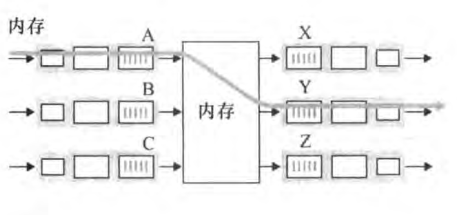
若内存带宽为每秒可写进或读出B个分组，则总的转发吞吐量（分组从输入端口被传送到输出端口的总速率）必然小于B/2
- 经一根总线交换：
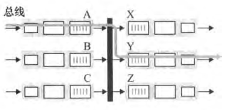
由于总线是共享的，所以一次只能有一个分组通过总线传送。因为每个分组必须跨过单一总线，所以路由器的交换带宽受总线速率的影响
- 经一个互联网络交换：
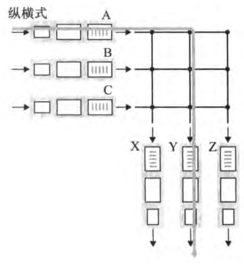
一个到达某个输入端口的分组沿着连到输入端口的水平总线穿行，直至该水平总线与连到所希望的输出端口的垂直总线的交叉点。如果该条连到输出端口的垂直总线是空闲的，则该分组被传送到输出端口。如果该垂直总线正用于传送另一个输入端口的分组到同一个输出端口中，则该到达的分组被阻塞，且必须在输入端口排队

#### 输出端口
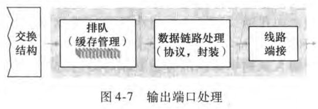

#### 何时出现排队
输入端口和输出端口处都能够形成分组队列。随着这些队列的增长，路由器的缓存空间将会最终耗尽，且会出现丢包（packet loss）。
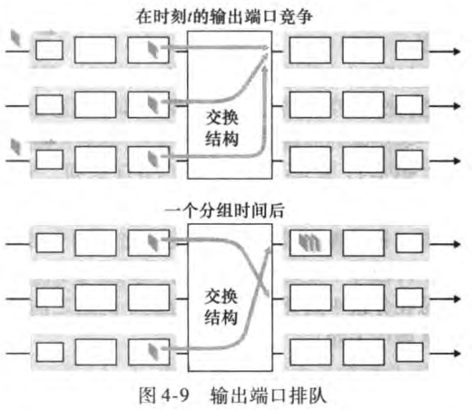
输出端口排队的后果就是，输出端口上的一个分组调度程序（packet scheduler）必须在这些排队的分组中选出一个来传送。分组调度程序在提供**服务质量保证**（quality-of-service guarantee）方面起着关键作用。
如果没有足够的内存来缓存一个入分组，那么必须作出决定：要么丢弃到达分组（一种称为弃尾（drop-tail）的策略），要么删除一个或多个已经排队的分组以便为新来的分组腾出空间。在某些情况下，在缓存填满前便丢弃（或在其首部加标记）一个分组，以便向发送方提供一个拥塞信号，这种策略称为**主动队列管理**（Active Queue Management，AQM）算法。随机早期检测（RED）算法是一种得到最广泛研究的AQM算法。

输入排队交换机中的**线路前部（Head-Of-the-Line，HOL）阻塞**，即在一个输入队列中排队的分组必须等待通过交换结构发送（即使输出端口是空闲的），因为它由位于线路前部的另一个分组阻塞。
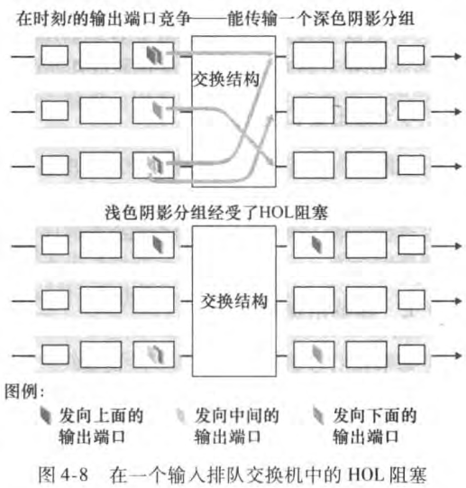

#### 分组调度
##### 先进先出
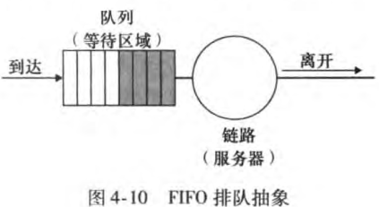
如果链路当前正忙于传输另一个分组，到达链路输出队列的分组要排队等待传输。如果没有足够的缓存空间来容纳到达的分组，队列的分组丢弃策略则确定该分组是否将被丢弃或者从队列中去除其他分组以便为到达的分组腾出空间。

FIFO调度规则按照分组到达输出链路队列的相同次序来选择分组在链路上传输。
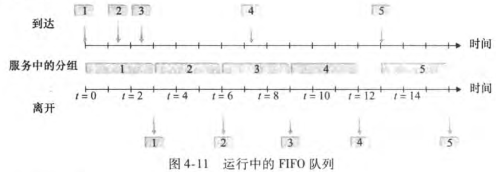

##### 优先权排队
在**优先权排队**（priority queuing）规则下，到达输出链路的分组被分类放入输出队列中的优先权类。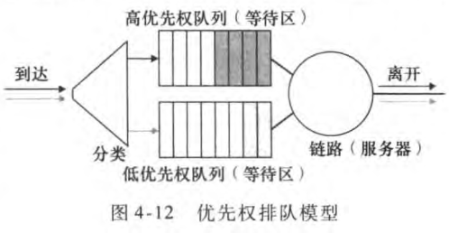
每个优先权类通常都有自己的队列。当选择一个分组传输时，优先权排队规则将从队列为非空（也就是有分组等待传输）的最高优先权类中传输一个分组。在同一优先权类的分组之间的选择通常以FIFO方式完成。
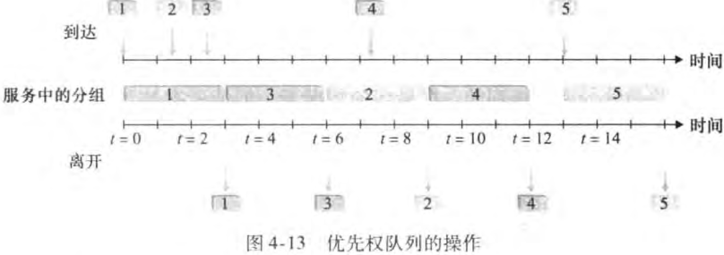
在**非抢占式优先权排队**（non-preemptive priority queuing）规则下，一旦分组开始传输，就不能打断。

##### 循环和加权公平排队
在**循环排队规则**（round robin queuing discipline）下，分组像使用优先权排队那样被分类。然而，在类之间不存在严格的服务优先权，循环调度器在这些类之间轮流提供服务。类1的分组被传输，接着是类2的分组，接着又是类1的分组，再接着是类2的分组，等等。一个所谓的**保持工作排队**（work-conserving queuing）规则在有（任何类的）分组排队等待传输时，不允许链路保持空闲。当寻找给定类的分组但是没有找到的时，保持工作的循环规则将立即检查循环序列的下一个类。
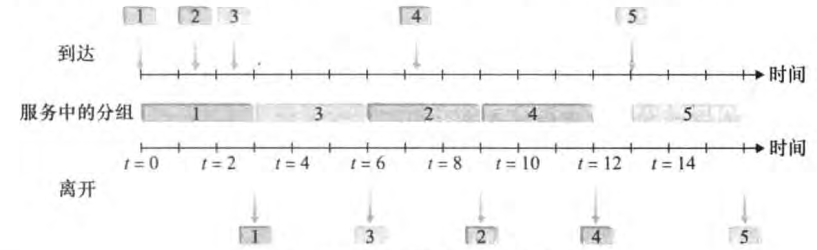

### IP：因特网中的转发和编址
因特网的网络层有三个主要的组件：
- IP协议
- 选路组件：决定数据报从源到目的地所流经的路径
- 报告数据报中的差错和对某些网络层信息请求进行响应的设施

#### Ipv4数据报格式
网络层分组称为数据报
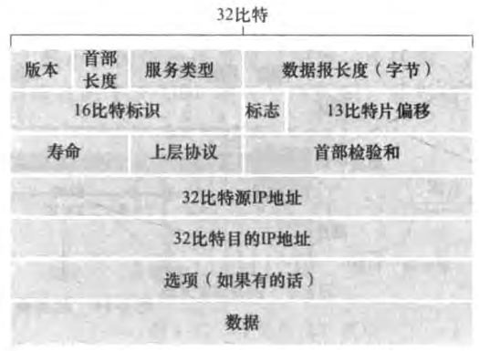
Ipv4数据报中的关键字段如下：
- 版本（号）：这4比特规定了数据报的IP协议版本。通过查看版本号，路由器能够确定如何解释IP数据报的剩余部分。不同的IP版本使用不同的数据报格式。
- 首部长度
- 服务类型：服务类型（TOS）比特包含在IPv4首部中，以便使不同类型的IP数据报能相互区别开来。
- 数据报长度：这是IP数据报的总长度（首部加上数据），以字节计。因为该字段长度为16比特，所以IP数据报的理论最大长度为65535字节。
- 标识、标志、片偏移：与IP分片有关。
- 寿命（Time-To-Live，TTL）：确保数据报不会永远在网络总循环。每当一台路由器处理数据报时，该字段的值减1。若TTL字段减为0，则该数据报必须丢弃。
- 协议：该字段通常仅当一个IP数据报到达其最终目的地时才会有用。
- 首部检验和：首部检验和用于帮助路由器检测收到的IP数据报中的比特错误。
- 源和目的IP地址：当某源生成一个数据报时，它在源IP字段中插入它的IP地址，在目的IP地址字段中插入其最终目的地地址。通常源主机通过DNS查找来决定目的地址。
- 选项：选项字段允许IP首部被扩展。
- 数据（有效载荷）：IP数据报中的数据字段包含要交付给目的地的运输层报文端（TCP或UDP）。该字段也可承载其他类型的数据，如ICMP报文。

#### IPv4数据报分片
不是所有链路层协议都能承载相同长度的网络层分组。有的协议能承载大数据报，而有的协议只能承载小分组。一个链路层帧能承载的最大数据量叫做**最大传送单元**（Maximum Transmission Unit，MTU）。因为每个IP数据报封装在链路层帧中从一台路由器传输到下一台路由器，故链路层协议的MTU严格地限制着IP数据报的长度。
将IP数据报中的数据分片层两个或更多个较小的IP数据报，用单独的链路层帧封装这些较小的IP数据报，然后通过输出链路发送这些帧。每个这些较小的数据报都称为**片**（fragment）。
片在其到达目的地运输层以前需要重新组装。为坚持网络内核保持简单的原则，IPv4的设计者决定将数据报的重新组装工作放到端系统中，而不是放到网络路由器中。
为了让目的主机执行重新组装任务，IPv4的设计则将标识、标志和片偏移字段放在IP数据报首部中。
当生成一个数据报时，发送主机在为该数据报设置源和目的地址的同时贴上标识号。
发送主机通常将它发送的每个数据报的标识号加1。
当某路由器需要对一个数据报分片时，形成的每个数据报（片）具有有初始数据报的源地址、目的地址与标识号。当目的地从同一发送主机收到一系列数据报时，它能够检查数据报的标识号以确定哪些数据报时间上是同一个大数据报的片。为了让目的主机绝对地相信它已收到了初始数据报的最后一个片，最后一个片的标志比特被设置为0，而所有其他片的标志比特被设为1。另外，为了让目的主机确定是否丢失了一个片（且能按正确的顺序重新组装片），使用偏移字段指定该片应放在初始IP数据报的哪个位置。
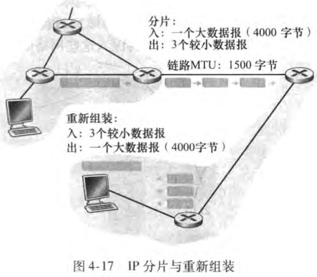 

#### IPv4编址
一台主机通常只有一条链路连接到网络；当主机中的IP想发送一个数据报时，它就在该链路上发送。主机与物理链路之间的边界称为**接口**（interface）。
因为路由器的任务是从链路上接收数据报并从某些其他链路转发出去，路由器必须拥有两条或更多条链路与它连接。路由器与它的任意一条链路之间的边界也叫做接口。一台路由器因此有多个接口，每个接口都有其链路。
因为每台主机与路由器都能发送和接收IP数据报，IP要求每台主机和路由器接口拥有自己的IP地址。因此，一个IP地址与一个接口相关联，而不是与包括该接口的主机或路由器相关联。

每个IP地址长度为32比特（4字节），因此总共有2^32个可能的IP地址。这些地址通常按所谓**点分十进制记法**（dotted-decimal notation）书写，即每个地址中的每个字节用它的十进制形式书写，各字节间用句号隔开。
例如，地址193.32.216.9的二进制记法为：`11000001 00100000 11011000 00001001`

一个接口的IP地址的一部分需要由其连接的子网来决定。
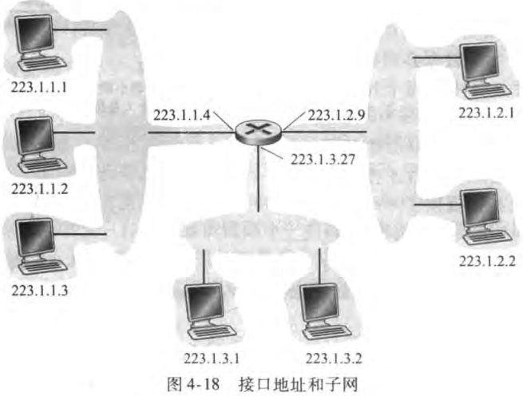
用IP的术语来说，互联左上角这3个主机接口与1个路由器接口的网络形成一个**子网**（subnet）。
IP编址为这个子网分配一个地址223.1.1.0/24，其中的`/24`记法，有时称为**子网掩码**（network mask），指示32比特中的最左侧24比特定义了子网地址。

为了确定子网，分开主机和路由器的每个接口，产生几个隔离的网络岛，使用接口端接这些隔离的网络的端点。这些隔离的网络中的每一个都叫做一个子网。

因特网的地址分配策略被称为**无类别域间路由选择**（Classless Interdomain Routing，CIDR）。当使用子网寻址时，32比特的IP地址被划分为两部分，并且也具有点分十进制形式a.b.c.d/x，其中x指示了地址的第一部分中的比特数。

形式为a.b.c.d/x的地址的x最高比特构成了IP地址的网络部分，并且经常被称为该地址的**前缀**（prefix）。一个组织通常被分配一块连续的地址，即具有相同前缀的一段地址。在这种情况下，该组织内部的设备的IP地址将共享共同的前缀。当该组织外部的一台路由器转发一个数据报，且该数据报的目的地址位于该组织的内部时，仅需要考虑该地址的前面x比特。

一个地址的剩余32-x比特可认为是用于区分该组织内部设备的，其中的所有设备具有相同的网络前缀。当该组织内部的路由器转发分组时，才会考虑这些比特。

在CIDR被采用之前，IP地址的网络部分被限制为长度为8、16、24比特，这是一种分类编址（classful addressing）的编址方案。

IP广播地址255.255.255.255，当一台主机发出一个目的地址为255.255.255.255的数据报时，该报文会交付给同一个网络中的所有主机。路由器也会有选择地向邻近的子网转发给报文。

##### 一个设备如何从某组织的地址块中分配到一块地址的
###### 获取一块地址
可以通过ISP从已分给它的更大地址块中提供一些地址。
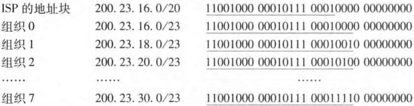

###### 获取主机地址：动态主机配置协议
某组织一旦获得了一块地址，它就可为本组织内的主机与路由器接口逐个分配IP地址。通常需要手动配置路由器中的IP地址。主机地址也能手动配置，但是这项任务目前更多的是使用**动态主机配置协议**（Dynamic Host Configuration，DHCP）来完成。DHCP允许主机自动获取（被分配）一个IP地址。网络管理员能配置DHCP，以使某给定主机每次与网络连接时能得到一个相同的IP地址，或者某主机将被分配一个临时的IP地址（temporary IP address），每次于网络连接时该地址也许是不同的。

由于DHCP具有将主机连接进一个网络的网络相关方面的制动能力，故它又常称为**即插即用协议**（plug-and-play protocol）或**零配置**（zeroconf）协议。

DHCP是一个客户-服务器协议。客户通常是新到达的主机，它要获得包括自身使用的IP地址在内的网络配置信息。在最简单情况下，每个子网将具有一台DHCP服务器。如果在某子网中没有服务器，则需要一个DHCP中继代理（通常是一台路由器），这个代理知道用于该网络的DHCP服务器的地址。
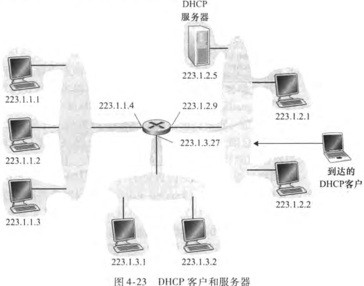

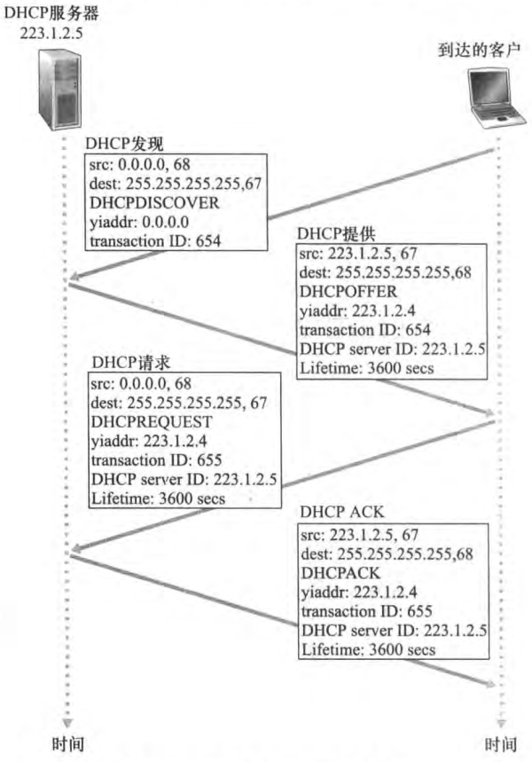
- DHCP服务器发现：一台新到达的主机的首要任务是发现一个要与其交互的DHCP服务器。这可通过使用DHCP发现报文（DHCP discover message）来完成，客户在UDP分组中向端口67发送该发现报文。该UDP分组封装在一个IP数据报中。DHCP客户生成包含DHCP发现报文的IP数据报，其中使用广播目的地址255.255.255.255并且使用“本主机”源IP地址0.0.0.0。DHCP将该IP数据报传递给链路层，链路层将该帧广播到所有与该子网连接的节点。
- DHCP服务器提供：DHCP服务器收到一个DHCP发现报文时，用**DHCP提供报文**（DHCP offer message）向客户做出响应，该报文向该子网的所有节点广播，仍然使用IP广播地址255.255.255.255。因为在子网中可能存在多个DHCP服务器，每台服务器提供的报文包含有收到的发现报文的事务ID、向客户推荐的IP地址、网络掩码以及IP地址租用期（address lease time），即IP地址的有效的时间量。
- DHCP请求：新到达的客户从一个或多个服务器提供中选择一个，并向选中的服务器提供用DHCP请求报文（DHCP request message）进行响应，回显配置的参数。
- DHCP ACK：服务器用DHCP ACK 报文（DHCP ACK message）对DHCP请求报文进行响应，证实所要求的参数。

#### 网络地址转换
网络地址转换（Network Address Translation，NAT）
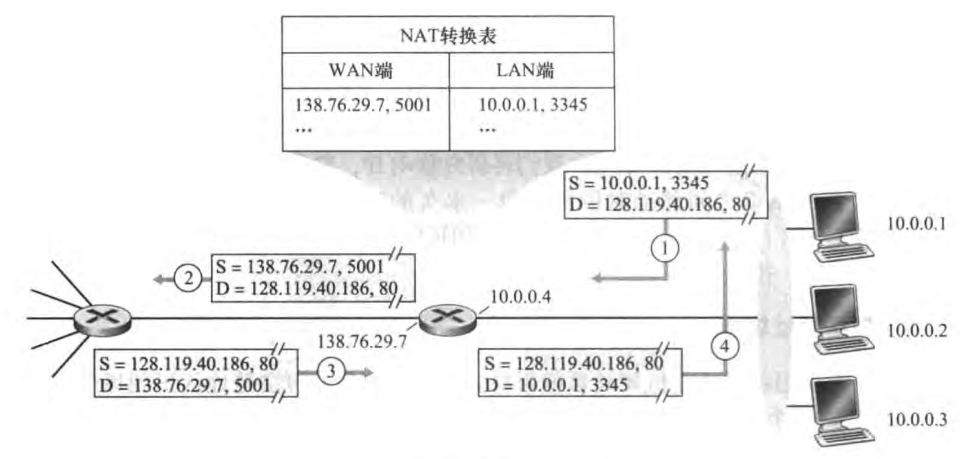
上图中右侧所有4个接口都具有相同的网络地址10.0.0/24。地址空间10.0.0.0/8是在[RFC 1918]中保留的三部分IP地址空间之一，这些地址用于家庭网络等专用网络（private network）或具有专用地址的地域（realm with private address）。具有专用地址的地域是指其地址仅对该网络中的设备有意义的网络。

NAT使能路由器对于外部世界来说甚至不像一台路由器。相反NAT路由器对外界行为就如同一个具有单一IP地址的单一设备。如上图中，所有离开家庭路由器流向更大因特网的报文都拥有一个源IP地址138.76.29.7，且所有进入家庭的报文都拥有同一个目的IP地址138.76.29.7。NAT使能路由器对外界隐藏了家庭网络的细节。

如果从广域网到达NAT路由器的所有数据都有相同的目的IP地址，路由器通过NAT路由器上的一张NAT转换表（NAT translation table）来知道它应将某个分组转发给哪个内部主机，并且在表项中包含了端口号及其IP地址。

#### IPv6
##### 数据报格式
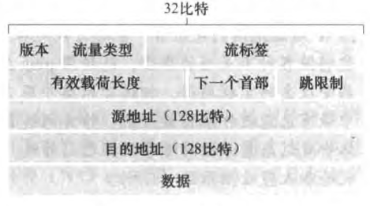
变化：
- 扩大的地址容量：IPv6将IP地址长度从32比特增加到128比特。除了单播地址与多播地址外，IPv6还引入了**任播地址**（anycast address）的新型地址。这种地址可以使数据报交付给一组主机中的任意一个。
- 简化高效的40字节首部
- 流标签

字段：
- 版本：用于标识IP版本号
- 流量类型
- 流标签
- 有效载荷长度
- 下一个首部：该字段标识数据报中的内容（数据字段）需要交付给哪个协议（如TCP或UDP）。该字段使用与IPv4首部中协议字段相同的值。
- 跳限制：转发数据报的每台路由器将对该字段的内容减1.如果跳限制计数达到0，则该数据报将被丢弃。
- 源地址和目的地址
- 数据：IPv6数据报的有效载荷部分。

### 通用转发和SDN
匹配加动作转发表在OpenFlow中称为**流表**（flow table），它的每个表项包括：
- 首部字段值的集合，入分组将与之匹配
- 计数器集合（当分组与流表项匹配时更新计数器）。这些计数器可以包括已经与该表项匹配的分组数量，以及自从该表项上次更新以来的时间。
- 当分组匹配流表项时所采取的动作集合。

#### 匹配
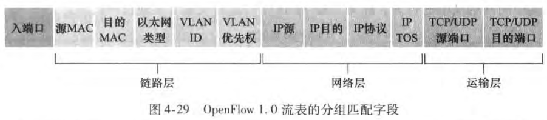
入端口是指分组交换机上接收分组的输入端口。

#### 动作
- 转发：一个分组可以转发到一个特定的物理输出端口，光波导所有端口（分组到达的端口除外），或通过所选的端口集合进行多播。该分组可能被封装并发送到用于该设备的远程控制器。该控制器可能（或可能不）对该分组采取某些动作。
- 丢弃：没有动作的流表项表明某个匹配的分组应当被丢弃
- 修改字段：在分组被转发到所选的输出端口之前，分组首部10个字段（除IP协议字段外的所有第二、三、四层的字段）中的值可以重写

### 选路算法
#### 路由选择算法（routing algorithm）
路由选择算法的目的是从发送方到接收方的过程中确定一条通过路由器网络的好的路径（等价于路由）。
通常，一条好路径指具有最低开销的路径。

路由选择算法的一种分类方式是根据该算法是集中式还是分散式来划分。
- 集中式路由选择算法（centralized routing algorithm）：用完整的、全局性的网络知识计算出从源到目的地之间的最低开销路径。该算法以所有节点之间的连通性及所有链路的开销为输入。具有全局状态信息的算法常被称为**链路状态（Link State，LS）算法**。
- 分散式路由选择算法（decentralized routing algorithm）：路由器以迭代、分布式的方式计算出最低开销路径。没有节点拥有关于所有网络链路开销的完整信息。相反，每个节点仅有与其直接相连链路的开销知识即可开始工作。然后，通过迭代计算过程以及与相邻节点的信息交换，一个节点逐渐计算出到达某目的节点或一组目的节点的最低开销路径。**距离变量（Distance-Vector，DV）算法**，每个节点维护到网络中所有其他节点的开销（距离）估计的向量。

路由选择算法的第二种广义分类方式是根据算法是静态的还是动态的进行分类：
- 静态路由选择算法（static routing algorithm）：路由随时间的变化非常缓慢，通常是人工进行调整。
- 动态路由选择算法（dynamic routing algorithm）：随着网络流量负载或拓扑发生变化而改变路由选择路径。

#### LS算法
在LS算法中，网络拓扑和所有的链路开销都是已知的。在实践中，这是通过让每个节点向网络中所有其他节点广播链路状态分组来完成的，其中每个链路状态分组包含它所连接的链路的标识和开销。在实践中，这经常由**链路状态广播**（link state broadcast）算法来完成的。

下面给出的LS算法称为Dijkstra算法。另一个算法为Prim算法。
- Dijkstra算法计算从某个节点（源节点）搭配网络中所有其他节点的最低开销路径。Dijkstra算法是迭代算法，其性质是经算法的第k次迭代后，可知道到k个目的节点的最低开销路径，在到所有目的节点的最低开销路径中，这k条路径具有k个最低开销。
    - D(v)：到算法的本次迭代，从源节点到目的节点v的最低开销路径的开销
    - p(v)：从源到v沿着当前最低开销路径的前一节点（v的neighbor）
    - N：节点子集：如果从源到v的最低开销路径已确知，v在N中
该算法在最差情况下时间复杂度为O(n^2)

#### DV算法
DV算法是一种迭代的、异步的和分布式的算法，而LS算法是一种使用全局信息的算法。说它是分布式的，是因为每个节点都要从一个或多个直接相连邻居接收某些信息，执行计算，然后将其计算结构分发给邻居。

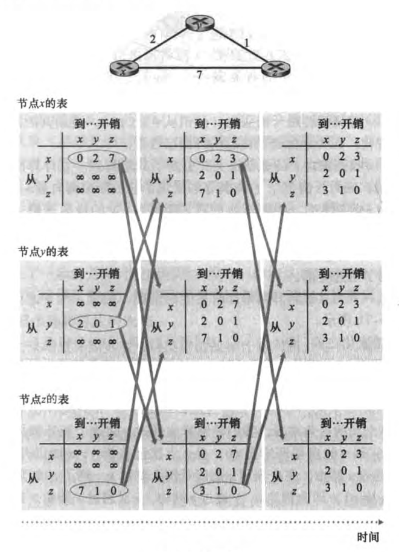
在节点重新计算它们的距离向量之后，它们再次向其邻居发送他们的更新距离向量。

##### 链路开销改变与链路故障
当一个运行DV算法的节点检测到从它自己到邻居的链路开销发生变化时，它就更新其距离向量，并且如果最低开销路径的开销发生了变化，向邻居通知其新的距离变量。

##### 增加毒性逆转
毒性逆转（poisoned reverse）：如果z通过y路由选择到目的地x，则z将通告y，它到x的距离是无穷大，因为y相信z没有到x的路径，故只要z继续经y路由选择到x，y将永远不会试图经由z路由到x。

##### LS与DV路由选择算法的比较
N是节点（路由器）的集合，而E是边（链路）的集合。

### 因特网中的自治系统内部的路由选择：OSPF
- 规模：随着路由器数目变得很大，涉及路由选择信息的通信、计算和存储的开销将变得很高。
- 管理自治：因特网是ISP的网络，其中每个ISP都有它自己的路由器网络。ISP通常希望按自己的意愿运行路由器，或对外部隐藏其网络的内部组织面貌。
这两个问题都可以通过将路由器组织进行**自治系统**（Autonomous System，AS）来解决，其中每个AS由一组通常处在相同管理控制下的路由器组成。通常在一个ISP中的路由器以及互联他们的链路构成一个AS。
在相同AS的路由器都运行相同的 路由选择算法并且有彼此的信息。在一个自治系统内运行的路由选择算法叫做**自治系统内部路由选择协议**

#### 开放最短路优先（OSPF）
OSPF中的开放（open）一词是指路由选择协议规范是公众可用的。
OSPF是一种链路状态协议，它使用洪泛链路状态信息和Dijkstra最低开销路径算法。
每台路由器在本地运行Dijkstra的最短路径算法，以确定一个以自身为根节点到所有子网的最短路径树。
使用OSPF时，路由器向自治系统内所有其他路由器广播路由选择信息，而不仅仅是向其相邻路由器广播。每当一条链路的状态发生变化时，路由器就会广播链路状态信息。即使链路状态没有发生变化，它也要周期性地广播链路状态。

OSPF的优点：
- 安全
- 多条相同开销的路径：当到达某目的地的多条路径具有相同的开销时，OSPF允许使用多条路径。
- 对单播和多播路由选择的综合支持
- 支持在单个AS中的层次结构

### ISP之间的路由选择：BGP
因为AS间路由选择协议涉及多个AS之间的协调，所以AS通信必须运行相同的AS间路由选择协议。在因特网中，所有的AS运行相同的AS间路由选择协议，称为**边界网关协议**（Broder Gateway Protocol，BGP）。

#### BGP的作用
在BGP中，分组并不是路由到一个特定的目的地址，相反是路由到CIDR化的前缀，其中每个前缀表示一个子网或一个子网的集合。在BGP的世界中，一个目的地可以采用138.16.68/22的形式，这个例子包括1024个IP地址。因此，一台路由器的转发表将具有形式为(x, I)的表项，其中x是一个前缀，I是该路由器接口之一的接口号。

- 从邻居AS获得前缀的可达性信息。
- 确定到该前缀的“最好的”路由。

#### 通告BGP路由信息
对于每个AS，每台路由器要么是一台**网关路由器**（gateway router），要么是一台**内部路由器**（internal router）。网关路由器是一台位于AS边缘的路由器，它直接连接到其他AS中的一台或多台路由器。内部路由器仅连接在它自己AS中的主机和路由器。
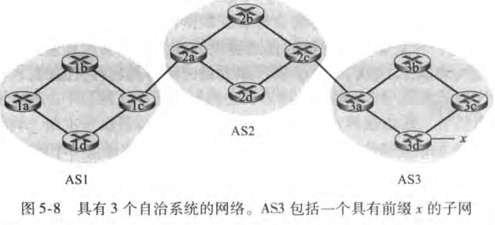
上图中，1c是网关路由器，1a、1b、1d是内部路由器

在BGP中，每对路由器通过使用179端口的半永久TCP连接交换路由选择信息。每条直接连接以及所有通过该连接发送的BGP报文，称为BGP连接（BGP connection）。跨越两个AS的BGP连接称为外部BGP（eBGP）连接，而在相同AS中的两台路由器之间的BGP会话称为内部BGP（iBGP）连接。
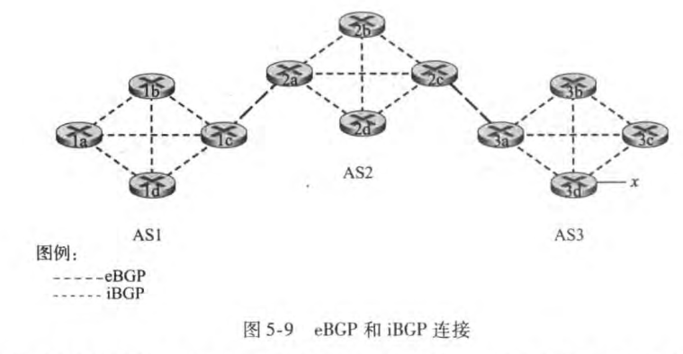

#### 确定最好的路由
当路由器通过BGP连接通告前缀时，它在前缀中国包括一些BGP属性（BGP attribute）。
前缀及其属性称为路由（route）。
两个重要的属性分别是：
- AS-PATH：包含了通告已经通过的AS列表。
- NEXT-HOP：是AS-PATH起始的路由器接口的IP地址。

##### 热土豆路由选择
热土豆路由选择（hot potato routing）
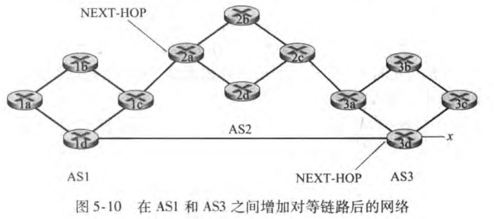
在这个例子中，1b将查询它的AS内部路由选择信息，以找到通往NSXT-HOP路由器2a的最低开销AS内部路径以及通往NEXT-HOP路由器3d的最低开销AS间路径，进而选择这些最低开销路径中具有最低开销的那条。

热土豆路由选择依据的思想是：对于路由器1b，尽可能快地将分组送出其AS，而不担心其AS外部到目的地的余下部分的开销。

##### 路由器选择算法
对于任何给定的目的地前缀，进入BGP的路由选择算法的输入是到某前缀的所有路由的集合，该前缀是已被路由器学习和接受的。如果仅有一条这样的路由，BGP则显然选择该路由。如果到相同的前缀有两条或多条路由，则顺序地调用下列消除规则直到下一条路由：
- 路由被指派一个**本地偏好**（local preference）值作为其属性之一。一条路由的本地偏好可能由路由器设置或在相同AS中的另一台路由器学习到的。
- 从余下的路由中，将选择具有最短AS-PATH的路由。如果该规则是路由选择的唯一规则，则BGP将使用距离向量算法决定路径，其中距离测度使用AS跳的跳数而不是路由器跳的跳数。
- 从余下的路由中，使用热土豆路由选择，即选择具有最靠近NEXT-HOP路由器的路由。
- 如果仍留下多条路由，该路由器使用BGP标识符来选择路由。

